# 데이터분석 2주차 정규과제

📌데이터분석 정규과제는 매주 정해진 분량의 『*혼자 공부하는 데이터 분석 with 파이썬*』 을 읽고 학습하는 것입니다. 이번 주는 아래의 **DataAnalysis_2nd_TIL**에 나열된 분량을 읽고 공부하시면 됩니다.

아래의 문제를 풀어보며 학습 내용을 점검하세요. 문제를 해결하는 과정에서 개념을 스스로 정리하고, 필요한 경우 제시된 강의를 참고하여 보완하는 것이 좋습니다.

<!-- 강의 링크는 아래와 같습니다.
https://www.youtube.com/watch?v=s_-VvTLb3gs&list=PLVsNizTWUw7FGzSRCkQrPEEe-ljVXgS7k&index=4
https://www.youtube.com/watch?v=Il6L8OtNFpc&list=PLVsNizTWUw7FGzSRCkQrPEEe-ljVXgS7k&index=5
-->


## DataAnalysis_2nd_TIL

### 2장 데이터 수집하기
#### 01. API 사용하기
#### 02. 웹 스크래핑 사용하기


## Study Schedule

| 주차  | 공부 범위     | 완료 여부 |
| ----- | ------------- | --------- |
| 1주차 | p.24~81    | ✅         |
| 2주차 | p.84~151   | ✅         |
| 3주차 | p.154~219  | 🍽️         |
| 4주차 | p.222~279 | 🍽️         |
| 5주차 | p.282~325 | 🍽️         |
| 6주차 | p.328~379 | 🍽️         |
| 7주차 | p.382~430 | 🍽️         |

<br>

<!-- 여기까진 그대로 둬 주세요-->


# 1️⃣ 개념 정리 

## 01. API 사용하기

**데이터를 가져올 때**
- 데이터베이스에서 가져오기
- API 사용하는 방법
- 웹 스크래핑 사용하는 방법

**데이터베이스 관리자 -> 직접적으로 사용자, 개발자가 데이터에 접근하는 것을 허용 X**
- 민감한 정보가 있을 수 있어서
- 데이터 무결성 유지를 위해서 
...

### API, HTTP

**API** 
- 프로그램 A와 프로그램 B가 정보를 주고 받으려면?
  
  -> 둘 간의 규칙을 미리 정해야함 (시작부분, 끝나는 부분, 어떤 식으로 전달하고 받을지 등)

  = API

**웹 브라우저가 사용하는 *통신 규약* = *HTTP***
- 텍스트 기반의 프로토컬

  -> 텍스트로 서로 주고 받는 것
- 웹 서버 -- 통신 (HTTP 프로토콜) -- 웹 브라우저
  
> **웹 브라우저** -- 데이터 요청 (HTTP) --> **웹 서버**
> **웹 서버** -- 그에 맞는 웹 페이지 전송 (HTML) --> **웹 브라우저**
>
> 프로그램 A -- **데이터 요청 (HTTP)** --> 프로그램 B
> 프로그램 B -- **데이터 전송 (CSV, JSON. XML)** --> 프로그램 A
>
> 웹 기반 API: HTTP로 데이터를 요청 / CSV, JSON, XML 파일로 전송받음 (~HTML~)

### 1. JSON
*: {"name": "혼자 공부하는 데이터분석"}*
- 파이썬의 리스트처럼 대괄호로 더 복잡하게 표현 가능
 > d = {"name": "혼자 공부하는 데이터분석"}
 >
 > print(d['name'])
 >
 > 출력: 혼자 공부하는 데이터 분석

#### JSON 문자열 다루기
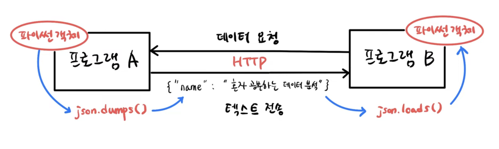

#### 복잡한 JSON 구조
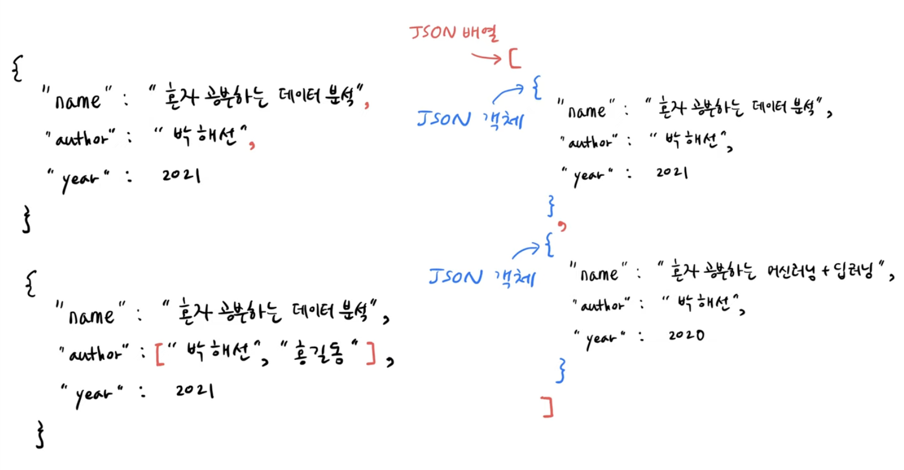

- JSON 객체 안에 JSON 배열이 들어갈 수 있음
- JSON 객체를 여러개 가진 큰 JSON 배열을 만들 수 있음 

#### read_json
*: pandas에 json 문자열을 넣으면 자동으로 표 형식으로 만들어짐*

#### 파이썬 객체 -> JSON.dumps() -> JSON.loads -> 파이썬 객체

### 2. XML
*: HTML 보다 정제된 버전*

- 시작태그: <book>
- 종료태그: <**/**book>

> <name> 혼자 공부하는 데이터분석 </name>
> <author> 박해선 </author>
> <year> 2021 </year> 

#### findtext()

> name = book(부모).**findtext**('name') (자식)
> author = book.**findtext**('author')
> year = book.**findtext**('year')
>
> => 혼자 공부하는 데이터분석 // 박해선 // 2021 
>
> => 자식 엘리먼트에 있는 각각의 값을 출력할 수 있음

### 20대가 가장 좋아하는 도서는?
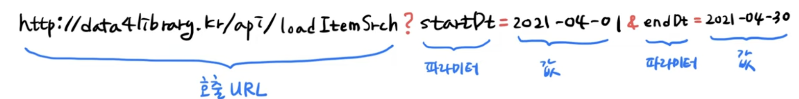

*http://4library.kr/api/loanItemSrch?format=json&startDt=2021-04-01&endDt=2021-04-30&**age=20**&**authKey=인증키***
- 20대가 좋아하는 도서 -> age
- 이 API를 인증된 사용자만 호출 허락하도록 구성


## 02.웹 스크래핑 사용하기

- 도서관 정보나루 데이터에는 책의 쪽수 정보가 없음

  -> 따로 yes24 사이트에서 쪽수 정보를 가져와야함

### 웹 크롤링

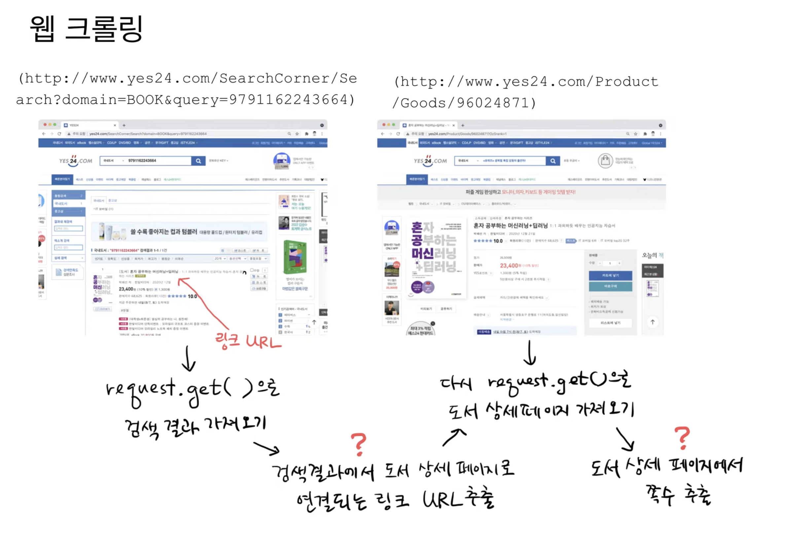
- HTML에 있는 내용을 가져와서, 원하는 정보는 뽑는 과정 = **웹 크롤링, 웹 스크랩핑**

- HTML 가져온 뒤, 쪽수를 골라내야함

  -> **뷰티플수프** : 전체 HTML에서 원하는 태그의 요소를 검색할 수 있는 도구

> 전체 HTML에서 id 가 infoset_specific 인 div를 찾아줘
>
>  -> div id="infoset_specific"

> - 파서: 입력 데이터를 받아, 데이터 구조를 만드는 소프트웨어 라이브러리
> - 파싱: 파서 과정
>  
>        -> json, xml 패키지 = 각각 JSON, XML을 위한 파서

**find() 메서드**
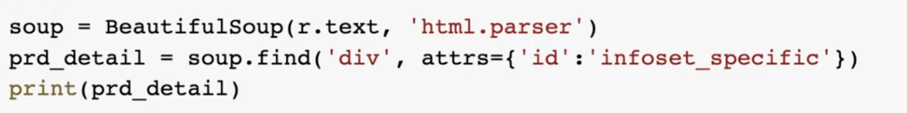
- soup 개체를 만듦 -> soup 개체의 find 메서드()에 입력한 내용

  : div 태그를 찾아주는데, id가 라는 infoset_specific속성을 가진 div 태그를 찾아줘
  
  -> 그럼 찾으려는 대상 **쪽수**가 있는 부분을 찾을 수 있음

**fing_all() 메서드**
 
- <tr> 태그 중 몇 번째에 쪽수가 들어가있는지 사전에 정의하기 어려움
- 몇 번째 <tr>태그에 들어가있는지 모르기에 *fing_all() 메서드* 
  
  -> 앞에서 찾은 div태그 아래에 있는 모든 tr을 찾아서 tr태그에 있는 th태그의 값이 *쪽수,무게,크기* 인지 확인

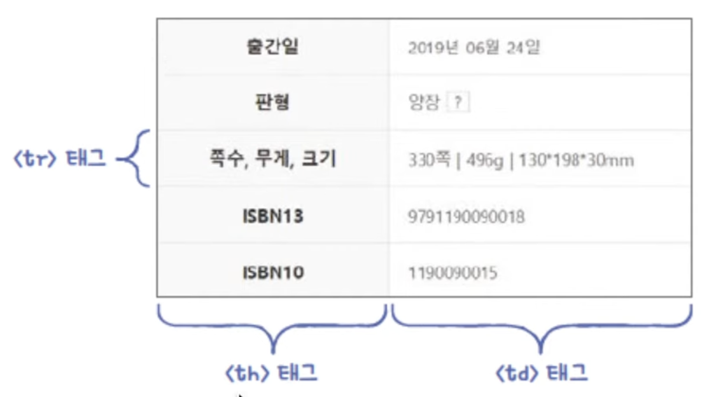 

#### 웹 스크랩핑 주의할 점

- 웹스크랩핑은 웹사이트가 바뀌면 HTML도 바뀜 -> 다시 프로그램을 수정해야할 수도..
- 웹사이트에서 스크래핑을 허락했는가?
- HTML 태그를 특정할 수 있는가? (뷰리플스프로 특정태그를 찾으라고 명령할 수 있는지?)
- 페이지가 동적으로 생성? (-> 동적이면 복잡해짐)
- 디자인이 자주 변경? (-> 디자인이 바뀌면 복잡해짐)

### 데이터프레임

#### 데이터프레임의 행, 열 선택하기

> books = book_df[['no','ranking'... ]] -> 열 출력
> book_df.loc[[0,1],['bookname','authors']] -> 원하는 열 지정하여 출력
> book_df.loc[[0:1],['bookname':'authors']] 
>
> -> bookname ~ authors 까지 / 여러열을 뛰어넘어 다음 열까지 등을 지정할 수 있음
>
> book_df.loc[::2, 'no':'isbn13'].head()
>
> -> ::2, 즉 행을 두개씩 건너뛰면서 출력할 수 있음
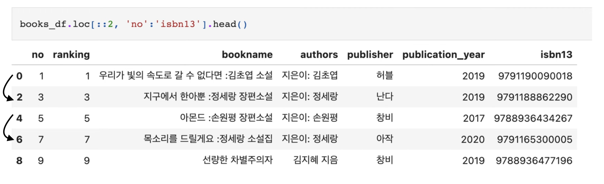
 


# 2️⃣ 수행 인증

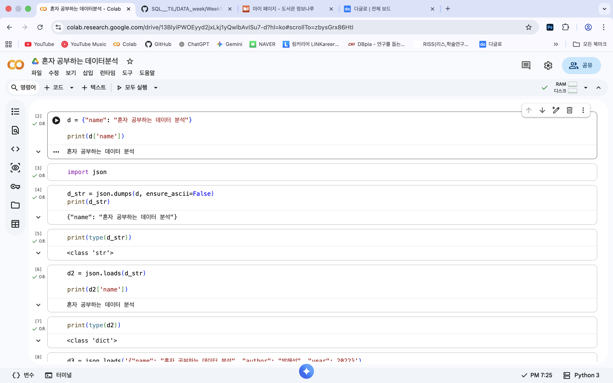
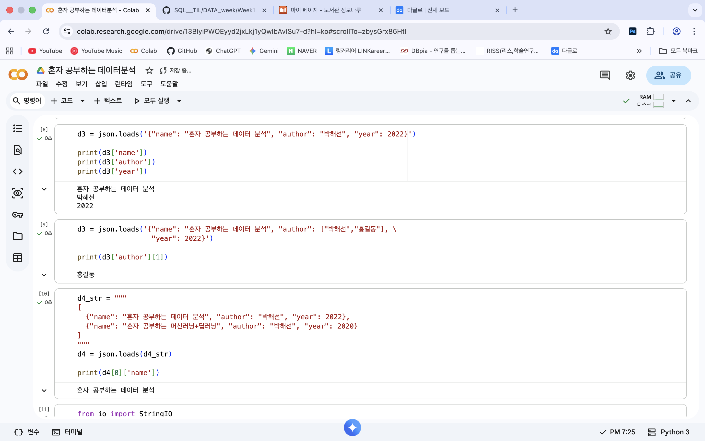
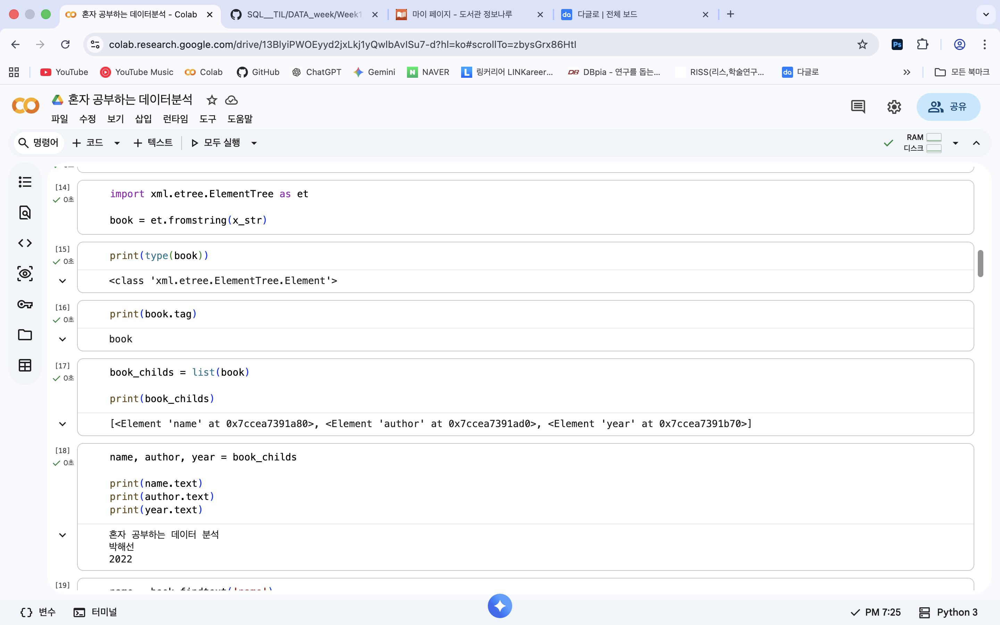
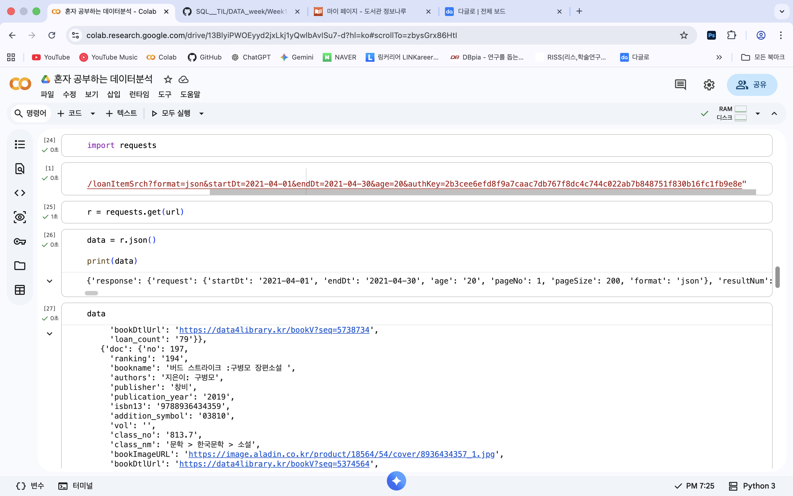
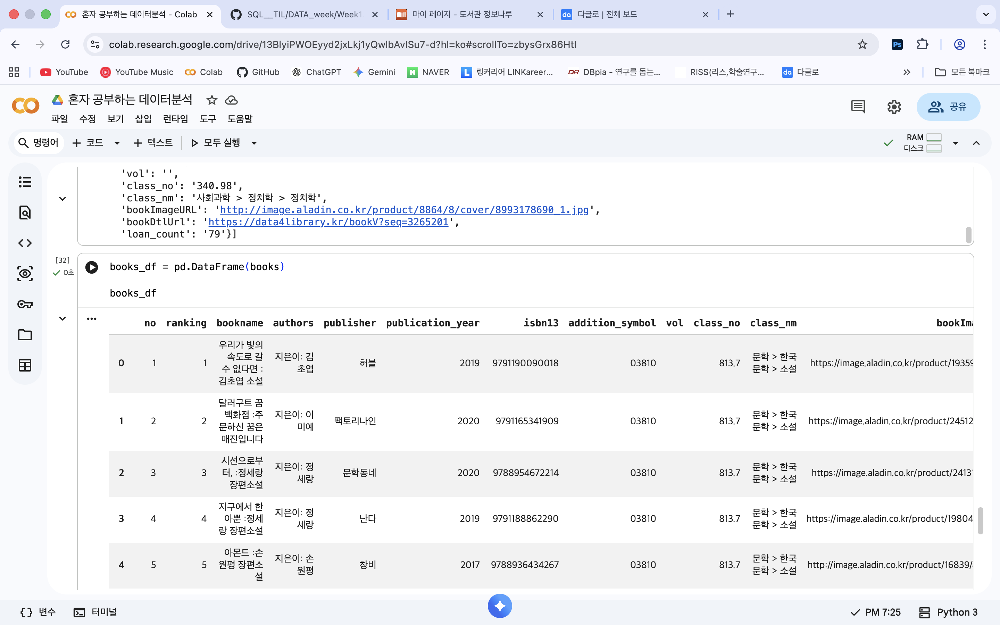


<br>
<br>

# 3️⃣ 확인 문제

## 문제 1.

> **🧚Q. 다음 중 BeautifulSoup 외에 웹 스크래핑에 사용할 수 있는 파이썬 패키지로 가장 적절한 것은 무엇인가요?**

```
1️⃣ NumPy  
2️⃣ Scrapy  
3️⃣ Matplotlib  
4️⃣ Scikit-learn  
```

```
답: 2번 Scrapy

BeautifulSoup는 웹 페이지의 HTML 및 XML 문서에서 원하는 데이터를 추출할 때 사용하는 파이썬 라이버리리입니다. 이를 대신하여 Scrapy를 사용할 수 있습니다. 이는 단순 라이브러리를 넘어, 웹 사이트를 돌아다니며 데이터를 수집, 저장하는 전 과정을 관리합니다. 

예시)
→  BeautifulSoup는 내가 가진 책에서 특정 문장, 단어를 찾아내는 도구 
→  Scrapy는 내가 책을 가져올 필요 없이, 알아서 도서관을 돌아다니며 정보를 수집하는 도구
```


### 🎉 수고하셨습니다.