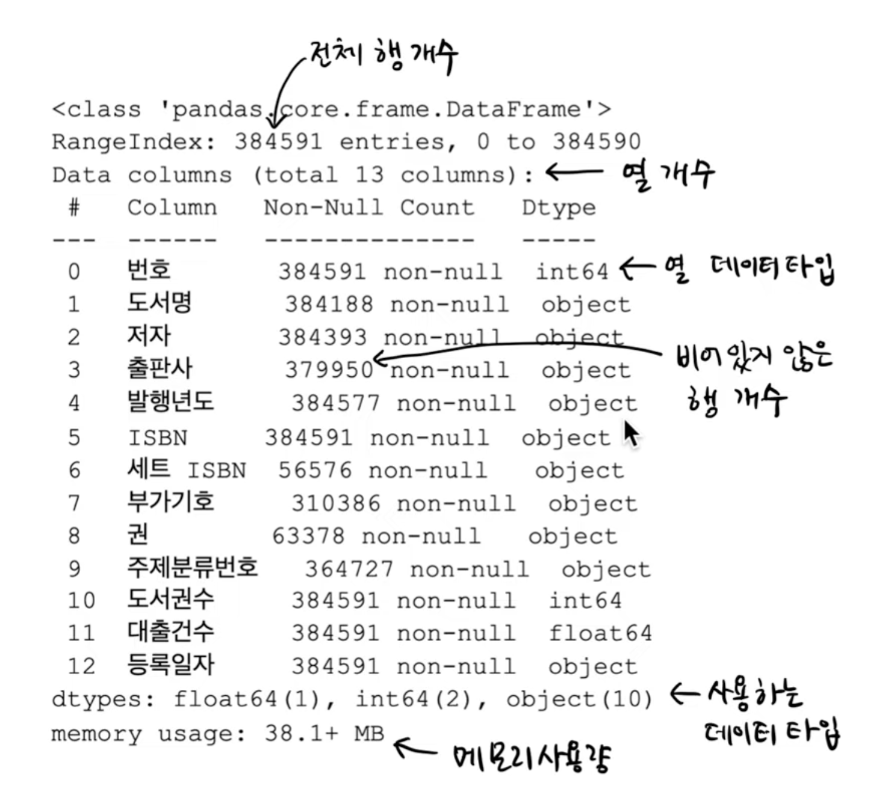
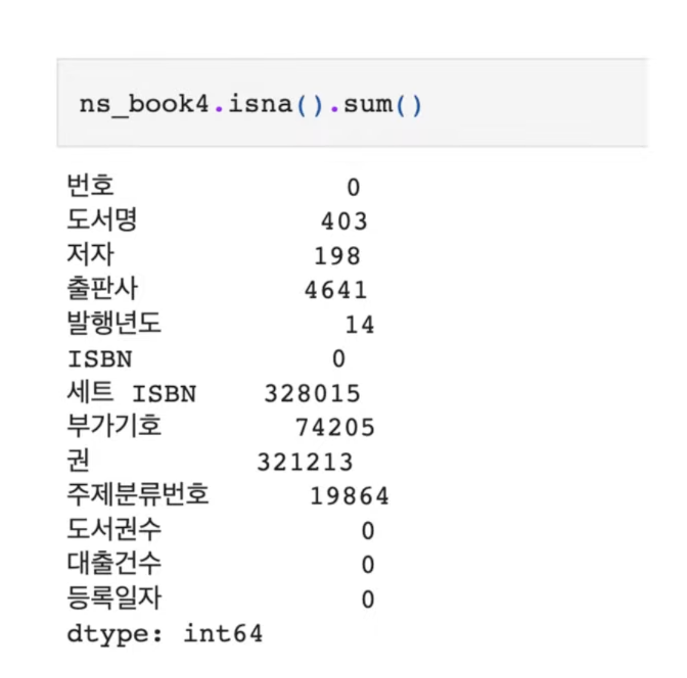
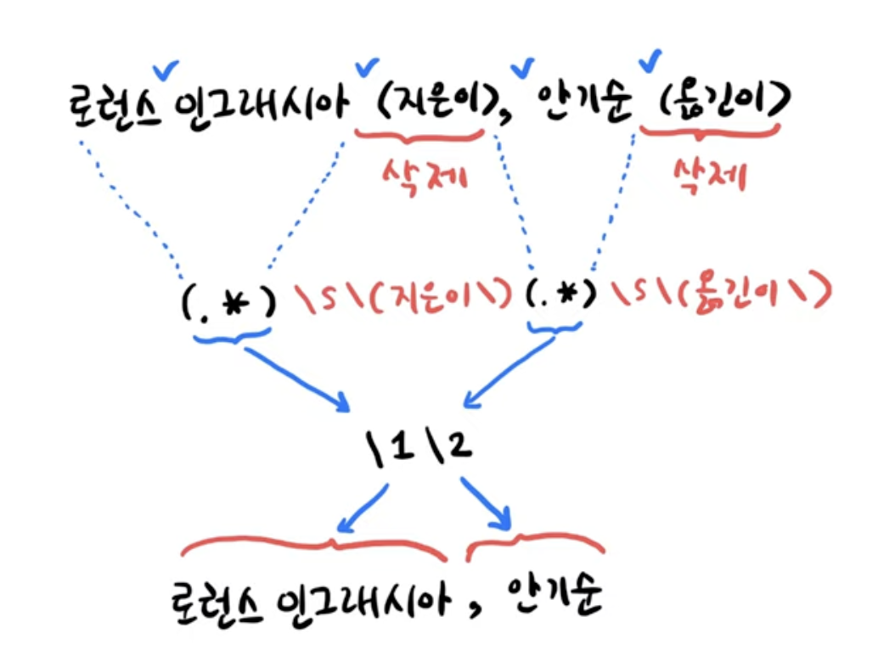

# 데이터분석 3주차 정규과제

📌데이터분석 정규과제는 매주 정해진 분량의 『*혼자 공부하는 데이터 분석 with 파이썬*』 을 읽고 학습하는 것입니다. 이번 주는 아래의 **DataAnalysis_3rd_TIL**에 나열된 분량을 읽고 공부하시면 됩니다.

아래의 문제를 풀어보며 학습 내용을 점검하세요. 문제를 해결하는 과정에서 개념을 스스로 정리하고, 필요한 경우 제시된 강의를 참고하여 보완하는 것이 좋습니다.

<!-- 강의 링크는 아래와 같습니다.
https://www.youtube.com/watch?v=CE3_InvbmLY&list=PLVsNizTWUw7FGzSRCkQrPEEe-ljVXgS7k&index=6
https://www.youtube.com/watch?v=hhbzUEQWdTg&list=PLVsNizTWUw7FGzSRCkQrPEEe-ljVXgS7k&index=7
-->


## DataAnalysis_3rd_TIL

### 3장 데이터 정제하기
#### 01. 불필요한 데이터 삭제하기
#### 02. 잘못된 데이터 수정하기


## Study Schedule

| 주차  | 공부 범위     | 완료 여부 |
| ----- | ------------- | --------- |
| 1주차 | p.24~81    | ✅         |
| 2주차 | p.84~151   | ✅         |
| 3주차 | p.154~219  | ✅         |
| 4주차 | p.222~279 | 🍽️         |
| 5주차 | p.282~325 | 🍽️         |
| 6주차 | p.328~379 | 🍽️         |
| 7주차 | p.382~430 | 🍽️         |

<br>

<!-- 여기까진 그대로 둬 주세요-->


# 1️⃣ 개념 정리 

## 01. 불필요한 데이터 삭제하기

### 데이터 정제, 데이터 전처리
- 데이터 정제의 과정을 기록해두는 것도 중요함
   -> 바뀌지 않고, 일정하게 유지되도록 하는 게 좋음

### 열 삭제하기

#### loc 메서드와 불리언 배열

> ns_book = ns_df.loc[:, '번호' : '등록일자']
>
> ns_book.head()

-> 번호 ~ 등록일자 열까지 추출함

> 인덱스 배열: ["혼공", "분석", "파이썬"] == "분석" (<- 문자열과 비교)
>
> -> "혼공" == "분석" > False
>
> -> "분석" == "분석" > True
>
> -> "파이썬" == "분석" > False

> selected_columns = ns_df.columns **!=** 'Unnamed: 13'
>
> ns_book = ns_df.loc[:,selected_columns]
>
> -> 컬럼 중에서 'Unnamed: 13' 가 아닌 것! 
>
> 'Unnamed: 13' => False, 나머지 => True

#### drop 메서드
> ns_book = ns_df.drop('Unnamed: 13',axis=1)

#### dropna 메서드
- ns_book = ns_df.dropna(axis=1)

-> 하나도 nan이 포함되어있지 않아야 출력됨

-> NAN이 하나라도 포함되어있으면, 삭제

- ns_book = ns_df.dropna(axis=1, how='all')

-> 열의 모든 원소가 NAN인 것만 삭제됨

  => unnamed 만 삭제됨

### 행 삭제


drop 메서드에서 행의 인덱스를 지정하여 삭제
- ns_book2 = ns_book.drop([0,1])

   -> 0, 1 인덱스가 삭제됨

#### [ ] 연산자와 불리언 배열

> selected_rows = ns_df['출판사'] == '한빛미디어'
>
> ns_book2 = ns_book[selected_rows]

-> '한빛미디어' 가 아닌 것은 *False*

=> '한빛미디어' 인 것만 출력됨

> ns_book2 = ns_book[ns_book['대출건수'] > 1000]

-> 대출건수가 1000보다 크면 *True*

### 중복된 행 찾기

| 도서명 | 출판사 | 발행연도 | T/F | 
|:---|:---:|:---:|:---:|
| 혼공 | 한빛 | 2021 | False |
| 혼공 | 한빛 | 2021 | True ✅ |  
| 혼공머신 | 한빛 | 2020 | False |

- **처음 행을 제외**한 나머지 중복된 행이 **True**

> dup_rows = ns_book.duplicated(subset='도서명','저자','ISBN'), **keep=False**
> ns_book3 = ns_book[dup_rows]

- **keep=False**: 중복된 첫번째 행도 True로 만들어주기에, 어떤 행들, 몇 권이 중복되었는지 확인할 수 있음

### 그룹별로 모으기

| 도서명 | 출판사 | 발행연도 | 대출건수 | 
|:---|:---:|:---:|:---:|
| 혼공 | 한빛 | 2021 | 2 ✅ |
| 혼공 | 한빛 | 2021 | 3 ✅ |  
| 혼공머신 | 한빛 | 2020 | 4 |

-> **GROUP BY** 

> loan_count = count_df.groupby(by=['도서명', '저자', 'ISBN', '권']dropna=False).sum()

-> by 매개변수: 기준이 되는 열을 지정할 수 있음

-> 도서명, 저자, ISBN, 권이 같으면? group by로 묶어서 합을 확인해볼 수 있음


## 02. 잘못된 데이터 수정하기

- 데이터 값이 비어있거나, 정수로 되어있어야하는데 섞여있거나...

#### info ( ) 메서드


#### isna( ) 메서드


#### NaN

> ns_book4.loc[0, '도서권수'] = None
>
> ns_book4['도서권수'].isna( ). sum ( )

-> 숫자형 데이터인 도서권수(정수형)에 null을 넣으면 pandas는 NaN 로 인식...?

-> 실수형으로 바꾸게 됨

> **import** numpy **as** np
>
> ns_book4.loc[0, '부가기호'] = np.nan

-> 문자형 데이터인  '부가기호'에 NaN 을 넣으면 NaN 그대로 들어감

#### fillna ( ) 

> ns_book4.**fillna**('없음').isna( ).sum( )
-> nan이라고 되어있는 모든 데이터를 '없음' 이라는 문자열로!

-> 누락된 문자열이 없게 됨

> ns_book4['부가기호'].fillna('없음').isna( ).sum( )
-> 전체가 아니라, 부가기호 열에서만 NaN이 되어있는 것을 '없음'으로!

> ns_book4.fillna({'부가기호' : '없음'}).isna( ).sum( )
-> 데이터프레임의 각 열에 NaN인 것의 통계값을 함께 전달해줌

#### replace ( )
- 어떤 특정값을 다른 값으로 바꿀 때

> ns_book4 replace(np.nan, '없음').isna() .sum()
 -> nan 인 것을 '없음'으로 모두 바꿔라 (=fillna)

> ns_book4. replace([**np.nan, '2021'**], [**'없음', '21'**]) head (2)
 -> nan 을 '없음'으로, 2021을 21로 

> ns_book4. replace({np.nan: '없음', '2021': '21'}) .head (2)
 -> nan 을 '없음'으로, 2021을 21로 

> ns_book4 .replace({'부가기호': np.nan}, '없음').head(2)
 -> '부가기호' 열의 nan 을 '없음' 으로!

> ns_book4.replace({'부가기호': {np.nan: '없음'}, '발행년도': {'2021': '21'}}) •head(2)
 -> '부가기호'에 있는 nan을 '없음' 으로

 -> '발행년도'에 있는 2021을 21로 대체


#### 정규표현식: \d
- 0~9까지 어떤 임의의 한 숫자에 대응
- 2021 이라는 4개의 숫자를 매칭하고 싶으면? 
  
  -> **\d** 를 4번 써야됨

  -> 만약 2021에서 뒤의 21만 추출하고 싶으면: \d\d **(\d\d)**

    => ( )을 사용 -> 2021에서 뒤의 숫자만 사용하겠다는 의미

> ns_book4.replace({'발행년도': (r'\d{2}(\d{2})': r'\1'}}, regex=True) [100:102]

 -> 발행년도의 뒷자리 2개만 추출됨

 -> 앞의 두 숫자는 매칭하지 않고, 버린 것



#### **(.*)**

-> 문자열을 매칭할 때는 글자수를 모름

   -> ~{ }~ -> **(.*)** 사용 
    
    => 앞에 몇 개의 글자가 온다는 걸 의미

-> '지은이' 정보를 만나기 전까지 모든 문자를 매칭할 거라면?

  -> \s\ (지은이\) => 공백 - 괄호 - 지은이\ - 괄호
    
> 공백문자: \s\

#### contains( ) 
> invalid _number = ns_book4[ '##HE']. str contains ('\D', na=True)
>
> print (invalid_number.sum () )
>
> ns_book4 [invalid_number]. head()

-> 숫자가 아닌 모든 것 **\D**
-> 숫자가 아닌 다른 값이 들어있는 모든 값을 추출

   ex) '1988.' 추출

> ns_books= ns_book4.replace({ '발행년도' : ‘.* (**\d{4}**) .*’ }, r'\1' , regex=True)
>
> ns_book5 [invalid_number] .head()

-> 발행년도에서 4개의 숫자가 있는 것만 매칭(\d{4}) + 그 앞/뒤에 어떤 문자든 (.*) 교체

  => 바른 연도로 추출


# 2️⃣ 수행 인증

<!-- 교재에서 안내된 과정을 직접 실행해본 뒤, 진행 결과가 보이도록 4~6장의 스크린샷을 캡처하여 아래에 첨부해주세요.-->
<!-- 이번 주차에는 API를 발급받는 과정도 포함하여 첨부해주세요.-->


<br>
<br>

# 3️⃣ 확인 문제

## 문제 1.

> **🧚Q. 다음 두 데이터프레임 df1, df2를 합쳐서 데이터프레임 df3를 만들려고 합니다.**  
> 적절한 판다스 명령을 선택해주세요.

<table>
<tr>

<td>

### df1

| index | col1 | col2 |
|-------|------|------|
| 0     | x    | 5    |
| 1     | y    | 6    |
| 2     | z    | 7    |

</td>

<td>

### df2

| index | col3 | col4 |
|-------|------|------|
| 0     | x    | 50   |
| 1     | y    | 60   |
| 2     | w    | 70   |

</td>

<td align="center" valign="middle">

<h2> ➜ </h2>

</td>

<td>

### df3 (결과)

| index | col1 | col2 | col3 | col4 |
|-------|------|------|------|------|
| 0     | x    | 5.0  | x    | 50.0 |
| 1     | y    | 6.0  | y    | 60.0 |
| 2     | z    | 7.0  | NaN  | NaN  |
| 3     | NaN  | NaN  | w    | 70.0 |

</td>

</tr>
</table>

```
1️⃣ pd.merge(df1, df2)
2️⃣ pd.merge(df1, df2, how='left')
3️⃣ pd.merge(df1, df2, left_on='col1', right_on='col3', how='outer')
4️⃣ pd.merge(df1, df2, left_on='col1', right_on='col3', how='inner')
```

```
여기에 선택한 답과 그 이유를 간단히 서술해주세요!
```


### 🎉 수고하셨습니다.