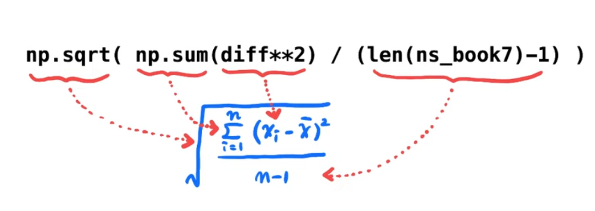
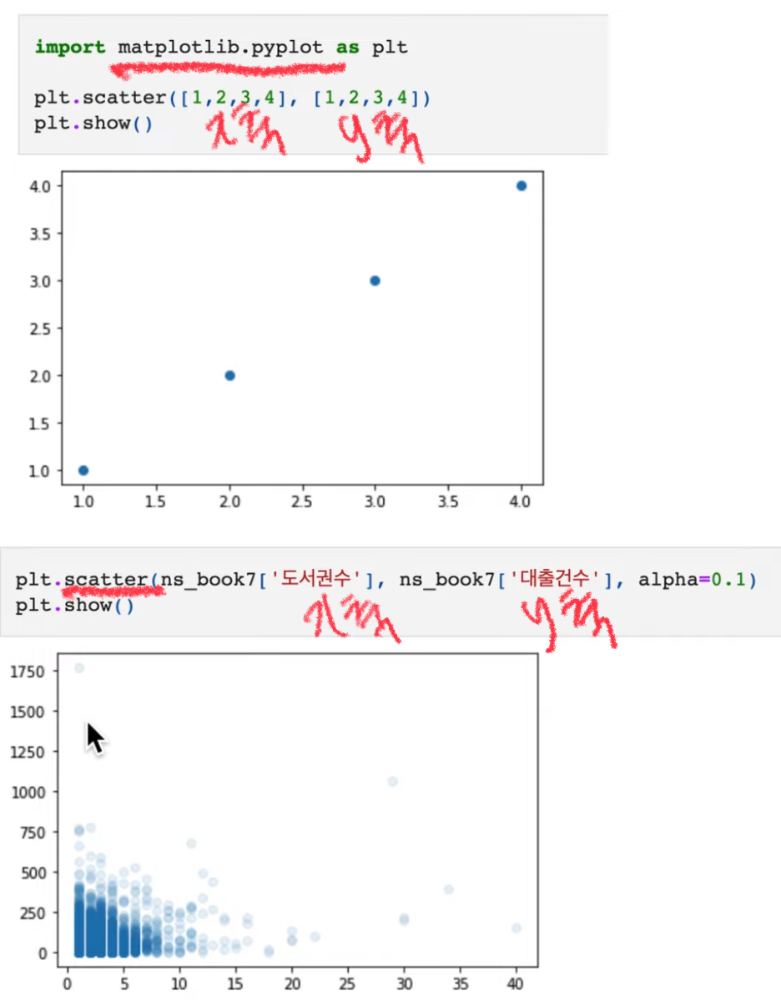
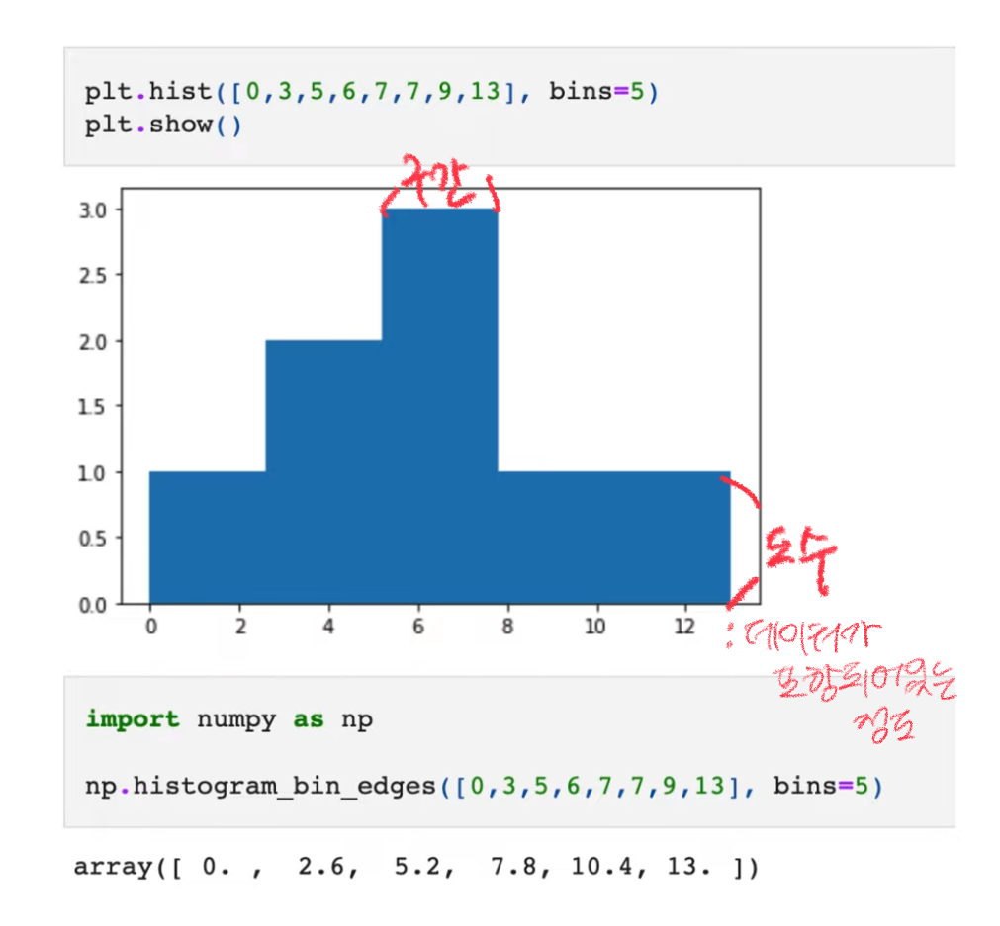
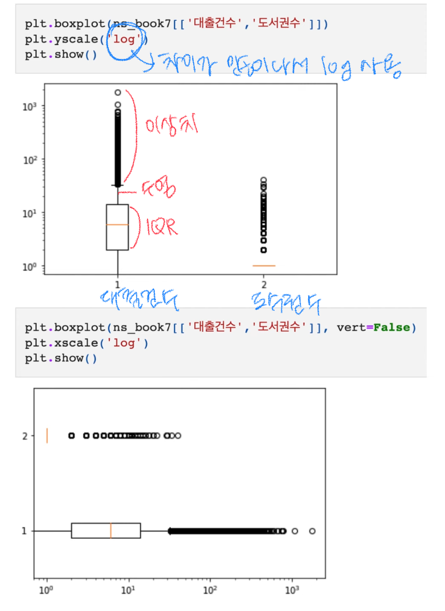
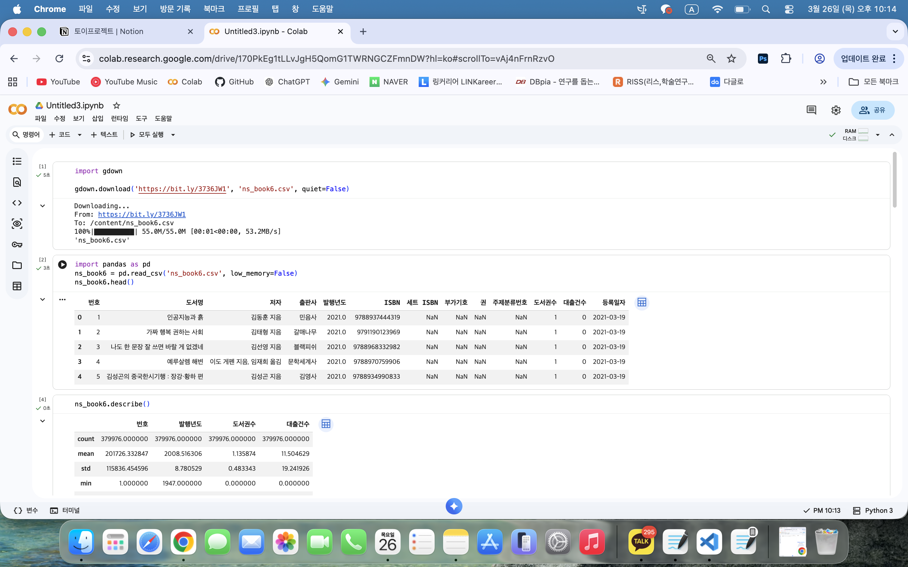
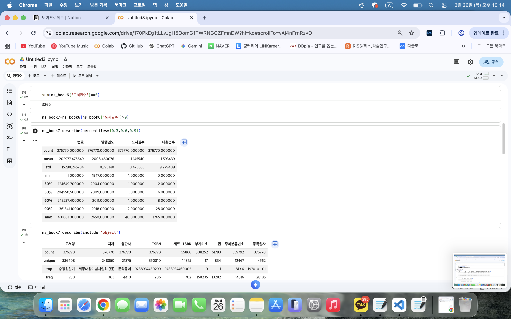
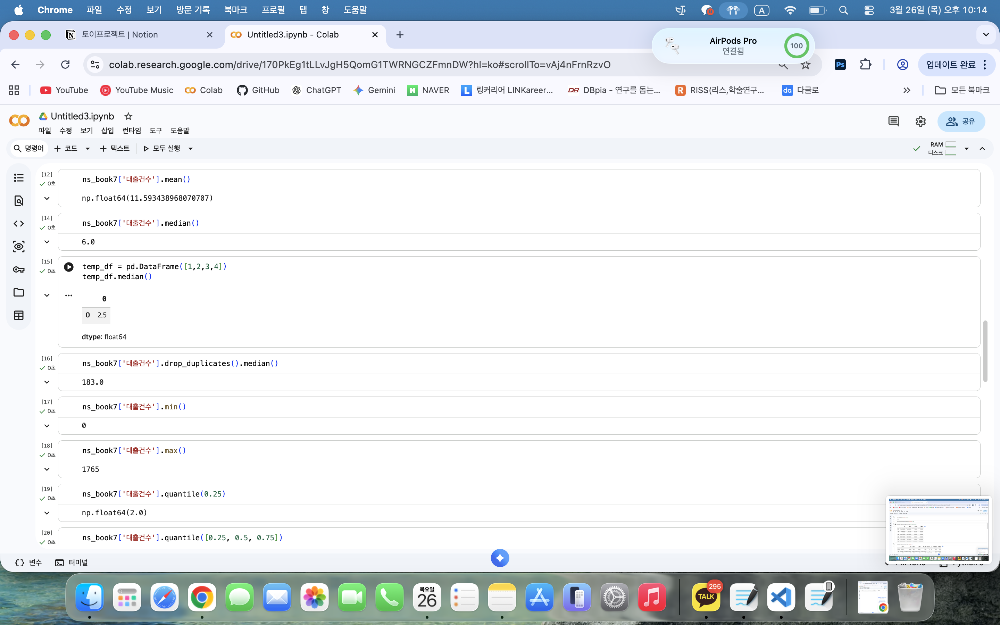

# 데이터분석 4주차 정규과제

📌데이터분석 정규과제는 매주 정해진 분량의 『*혼자 공부하는 데이터 분석 with 파이썬*』 을 읽고 학습하는 것입니다. 이번 주는 아래의 **DataAnalysis_4th_TIL**에 나열된 분량을 읽고 공부하시면 됩니다.

아래의 문제를 풀어보며 학습 내용을 점검하세요. 문제를 해결하는 과정에서 개념을 스스로 정리하고, 필요한 경우 제시된 강의를 참고하여 보완하는 것이 좋습니다.

<!-- 강의 링크는 아래와 같습니다.
https://www.youtube.com/watch?v=HNlRYQnLkek&list=PLVsNizTWUw7FGzSRCkQrPEEe-ljVXgS7k&index=8
https://www.youtube.com/watch?v=Cbk_tQtuhbM&list=PLVsNizTWUw7FGzSRCkQrPEEe-ljVXgS7k&index=9
-->


## DataAnalysis_4th_TIL

### 4장 데이터 요약하기
#### 01. 통계로 요약하기
#### 02. 분포 요약하기


## Study Schedule

| 주차  | 공부 범위     | 완료 여부 |
| ----- | ------------- | --------- |
| 1주차 | p.24~81    | ✅         |
| 2주차 | p.84~151   | ✅         |
| 3주차 | p.154~219  | ✅         |
| 4주차 | p.222~279 | ✅         |
| 5주차 | p.282~325 | 🍽️         |
| 6주차 | p.328~379 | 🍽️         |
| 7주차 | p.382~430 | 🍽️         |

<br>

<!-- 여기까진 그대로 둬 주세요-->


# 1️⃣ 개념 정리 

## 01. 통계로 요약하기

### Describe()

* 수치 데이터 타입 값 요약
* count / mean / std / min, max / 25, 50, 75%
  - 25, 50, 75 외 다른 위치에 있는 값을 알고 싶으면 => **percentiles**

  > ns_book.describe(percentiles=[0.3, 0.6, 0.9])
  > 
  > -> 30%, 60%, 90% 위치의 값 추출

* 문자열 타입의 값들 요약 => **include**
- count / unique, top, freq

  > ns_book.describe(include='object')
  > 
  > -> 보통 object 타입의 문자열 값 추출

### 평균 

~~~
x = [10, 20, 30]        
sum = 0
for i in range(3):
   sum += x[i]
print ("평균:", sum / len(x))   # x 리스트의 길이로 합을 나눈 것

ns_book['대출건수'].mean()      
~~~

### 중앙값

~~~
ns.book['대출건수'].median().    # 대출건수 나열시, 딱 가운데에 있는 값

temp_df = pd.dataframe([1,2,3,4])  # 데이터 수가 짝수 -> 두 값의 평균
temp_df.median()

>> 2.5 
~~~

### 최소, 최댓값

~~~ 
ns.book['대출건수'].min()        # 최솟값
ns.book['대출건수'].max()        # 최댓값
~~~

### 분위수

~~~ 
📌 50% (중앙값)
ns.book['대출건수'].quantile(0.25)

📌 25%, 50%, 75%
ns.book['대출건수'].quantile([0.25, 0.5, 0.75])

📌 quantile(0.9)
pd.Series([1,2,3,4,5]).quantile(0.9)
-> 1~5 에서 0.9의 위치에 있는 값
-> 4가 75%, 5가 100%에 위치
~~~

### 분산, 표준편차

* 분산: 데이터가 퍼져있는 정도
  - 가운데 모여있음 = 분산 ⬇️
  - 넓게 퍼져있음 = 분산 ⬆️
  - **ns_book['대출건수'].var()**

* 표준편차
  - ns_book['대출건수'].std()
  - numpy 는 좀 다름 
~~~
 import numpy as np
 diff = ns_book['대출건수'] - ns_book['대출건수'].mean()
 ns.sqrt(np.sum(diff**2) / (len(ns_book)-1)) 
~~~


### 최빈값
* 모든 값에 적용 ⭕️
  - ns_book['도서명'].mode()
  - ns_book['발행년도'].mode()


## 02. 분포 요약하기

### 산점도
- 주로 2차원
* 함수
  - matplotlib.pyplot
  - scatter

- 많이 겹쳐진 부분이 진한 것

### 히스토그램 -1

 * 함수
   - hist
   - bins=5 -> 원본데이터가 얼마나 포함되어있는지 도수로 알 수 있음

### 히스토그램 -2


* random.seed()
  - 난수 생성기의 시작값(초기값)을 설정
  - 같은 seed를 주면 항상 같은 랜덤 결과가 나오게 만듦
  
* random.randn()
* hist(random_samples)

### 상자수염그림

* boxplot(ns_book[['1번열','2번열']])

- 2개이상의 열을 비교할 때 좋음


# 2️⃣ 수행 인증





<br>
<br>

# 3️⃣ 확인 문제

## 문제 1.

> **🧚Q. 이번 주차에는 확인문제 대신 실습 과제를 진행합니다. 캐글에서 원하는 데이터셋을 선택하여 기술통계를 계산하고, 다양한 시각화를 수행해보세요.
작업은 코랩에서 진행한 뒤, 코랩 링크를 아래에 첨부해주세요.**

```
https://colab.research.google.com/drive/1nSubf_En0pEbS5HZE6HhkQZs9MW_pqUu?hl=ko#scrollTo=1cw-lDMRf2jy
```


### 🎉 수고하셨습니다.
