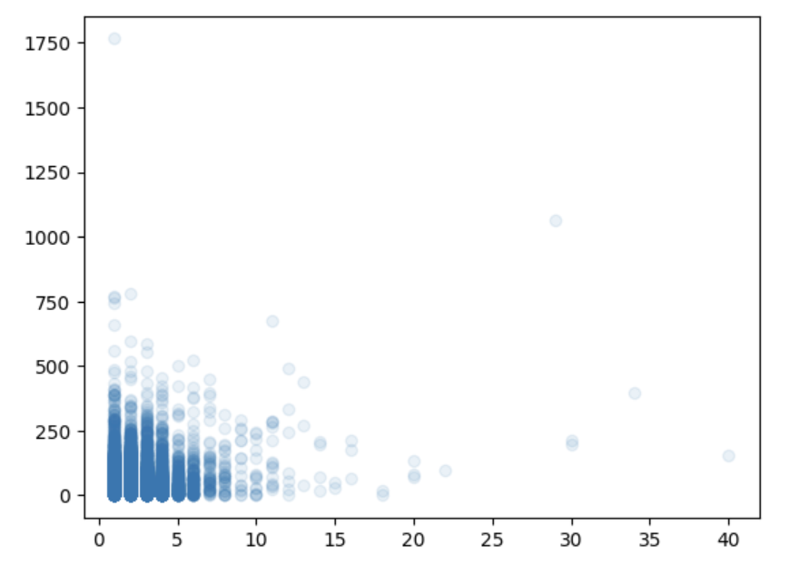
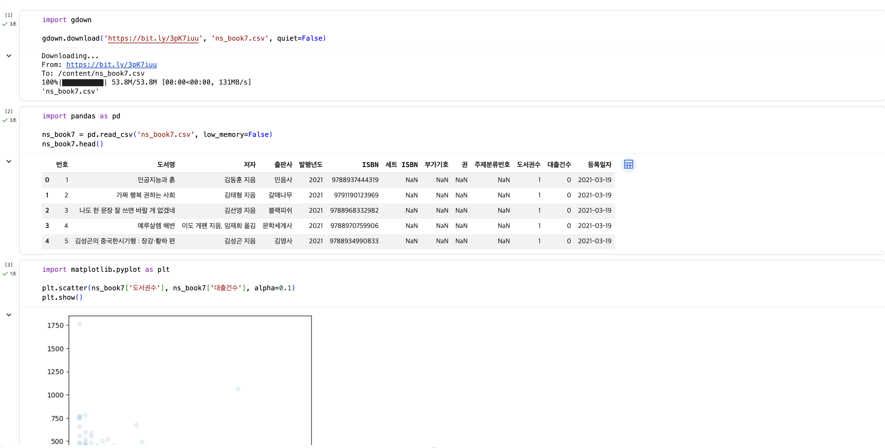
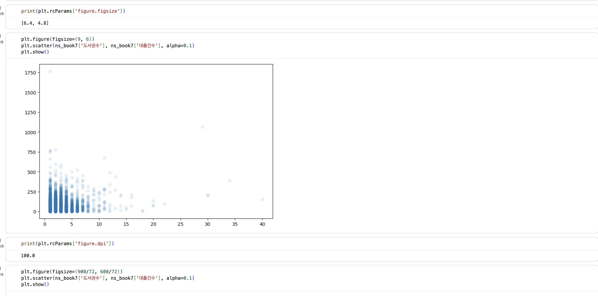
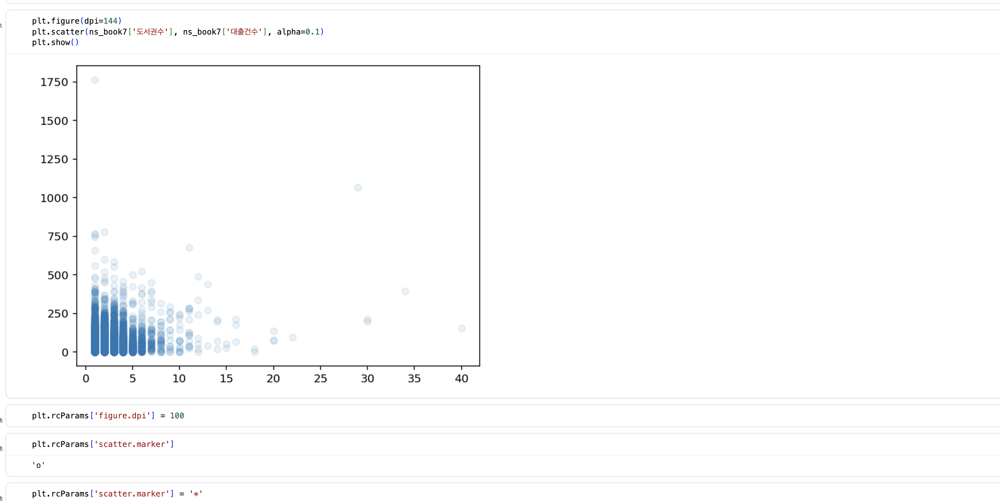
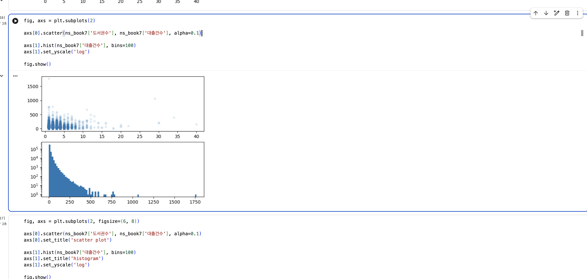

# 데이터분석 5주차 정규과제

📌데이터분석 정규과제는 매주 정해진 분량의 『*혼자 공부하는 데이터 분석 with 파이썬*』 을 읽고 학습하는 것입니다. 이번 주는 아래의 **DataAnalysis_5th_TIL**에 나열된 분량을 읽고 공부하시면 됩니다.

아래의 문제를 풀어보며 학습 내용을 점검하세요. 문제를 해결하는 과정에서 개념을 스스로 정리하고, 필요한 경우 제시된 강의를 참고하여 보완하는 것이 좋습니다.

<!-- 강의 링크는 아래와 같습니다.
https://www.youtube.com/watch?v=ho0LZ6GWhtc&list=PLVsNizTWUw7FGzSRCkQrPEEe-ljVXgS7k&index=10
https://www.youtube.com/watch?v=deYY4xHsI0o&list=PLVsNizTWUw7FGzSRCkQrPEEe-ljVXgS7k&index=11
-->


## DataAnalysis_5th_TIL

### 5장 데이터 시각화하기
#### 01. 맷플롯립 기본 요소 알아보기
#### 02. 선 그래프와 막대 그래프 그리기


## Study Schedule

| 주차  | 공부 범위     | 완료 여부 |
| ----- | ------------- | --------- |
| 1주차 | p.24~81    | ✅         |
| 2주차 | p.84~151   | ✅         |
| 3주차 | p.154~219  | ✅         |
| 4주차 | p.222~279 | ✅         |
| 5주차 | p.282~325 | ✅         |
| 6주차 | p.328~379 | 🍽️         |
| 7주차 | p.382~430 | 🍽️         |

<br>

<!-- 여기까진 그대로 둬 주세요-->


# 1️⃣ 개념 정리 

## 01. 맷플롯립 기본 요소 알아보기

### 맷플롯립 그래프를 담는 객체: 피겨, rcParams, 서브플롯

#### 1. Figure, 피겨 객체
- 모든 그래프 구성요소를 담고 있는 최상위 객체
- scatter() 함수로 산점도를 그릴 때 **자동생성**

```
import matplotlib.pyplot as plt

plt.scatter(ns_book7['도서권수'], ns_book7['대출건수'], alpha=0.1)
plt.show()


```
* **그래프가 더 잘보이도록 크기 키우기**
   - figsize 매개변수에 그래프의 크기를 튜플로 지정 ⭕️
     
     -> 기본 그래프 크기 (6,4) (너비, 높이) inch

```
plt.figure(figsize=(9, 6))
plt.scatter(ns_book7['도서권수'], ns_book7['대출건수'], alpha=0.1)
plt.show()

-> 너비가 9인치, 높이가 6인치인 피겨 객체 생성 
-> 크기가 커짐 
```

* **DPI 설정 확인**
   - dot per inch 
   - figsize 매개변수에 지정한대로 그래프가 안 그려짐 -> *DPI 확인*
   - DPI 에 따라 화면에 그려지는 그래프 크기가 달라짐

```
print(plt.rcParams['figure.dpi']) 

-> 맷플롯립의 기본 그래프 크기 확인
```

* **dpi 매개변수**
   - figsize 매개변수는 기본값 그대로, dpi 매개변수 지정

```
plt.figure(dpi=144)
plt.scatter(ns_book7['도서권수'], ns_book7['대출건수'], alpha=0.1)
plt.show()

-> dpi 값 72 -> 144
-> 인치당 픽셀 수가 두배로 늘어나며 x,y축의 숫자, 마커 모두 커짐 !!
```

#### 2. rcParams 객체

- 맷플롯립 그래프의 기본값을 관리
- 객체에 담긴 값 출력 + *새로운 값으로 바꾸기*

```
plt.rcParams['figure.dpi'] = 100  # DPI 기본값 바꾸기
plt.rcParams['scatter.marker'] 
marker='+' # 모양 바꾸기
```

#### 3. 서브플롯 출력

- 서브플롯: 맷플롯립의 Axes 클래스의 객체

     -> 두 개 이상의 축을 포함 (2차원: x, y축 / 3차원: 3개의 축)
- 하나의 피겨 안 <- 여러개의 서브플롯 ⭕️


* **subplots() 함수**
  1) 2개의 서브플롯 만들기 -> subplots(2)
  2) scatter(), hist() ... 함수 호출

```
fig, axs = plt.subplots(2)

axs[0].scatter(ns_book7['도서권수'], ns_book7['대출건수'], alpha=0.1)
# 첫번째 그래프

axs[1].hist(ns_book7['대출건수'], bins=100)
axs[1].set_yscale('log')
# 두번째 그래프

fig.show()
```

* 서브플롯 가로로 나란히 출력하기
  - subplots(2, 3) : 2개의 행 / 3개의 열
  - subplots(1, 2) : 1개의 행 / 2개의 열

```
subplots(1, 2, figsize=(10,4)) # 두개의 열을 갖기에, 피겨객체의 너비 늘림

set_title() # 제목지정
set_xlabel() 메서드 
set_ylabel() 메서드 # 각각 서브플롯의 축 이름 지정
```

## 02. 선 그래프와 막대 그래프 그리기

### 연도별 발행 도서 개수 구하기

#### 1. 연도별 도서 개수 구하기

* value_count()
   - 고유한 값의 등장 횟수 계산

```
count_by_year = ns_book7['발행년도'].value_counts()
count_by_year

-> 인덱스 | 값  
-> 내림차순으로 나옴
```

#### 2. 정렬

* sort_index()
   - 인덱스순으로 시리즈 객체를 정렬
   - x 축에 지정한 연도는 시간순으로 배치되는 게 좋기 때문

```
count_by_year = count_by_year.sort_index()
count_by_year

-> 근데 결과에 2650년까지의 도서가 있음
```

* index 속성이 2030 보다 작은 데이터만 추출
  - count_by_year[count_by_year.index <= 2030]

### 주제별 도서 개수 구하기

- '주제분류번호' 열에 코드가 기입되어있음
   
   ex) 1: 철학 / 2: 종교 ...
- 열에 NaN 포함 -> *-1로 변환*
- 주제분류번호 열의 값 -> 첫번째문자만 반환 ***kdc_1st_char()***

```
import numpy as np    # np.nan 사용하기 위해 넘파이

def kdc_1st_char(no):
    if no is np.nan:
        return '-1'   # 첫번째 문자 반환 / NaN인 경우 -1 반환
    else:
        return no[0]
```

### 선그래프 그리기 : plot()

1) 해상도 높이기: **DPI = 100**
   - plt.rcParams['figure.dpi'] = 100

2) 그리기: plot(), xlabel(), ylabel()

~~~
plt.plot(count_by_year.index, count_by_year.values) # x축, y축
plt.title('Books by year')                          # 제목
plt.xlabel('year')                                  # x축 이름
plt.ylabel('number of books')                       # y축 이름
plt.show()                  
~~~

3) 스타일 바꾸기: linestyle()
   - 실선: '**:**'
     점선: '**.**'
     쇄선: '**-**'
     파선: '**--**'
   - plt.plot(count_by_year, marker='.', linestyle=':', color='red') 

4) 선그래프 눈금 개수 조절 / 마커에 텍스트 표시

**4-1) xticks() / yticks() 함수**
- 축의 눈금 개수를 조정하는 함수
   - range()
   - 슬라이드 연산자(:): 연도별 발행 도서 개수를 모두 표시하기엔 많기에 뛰어넘기
   - items(): 인덱스와 값을 감싼 튜플 
   - annotate() : 그래프에 값 표시

```
plt.plot(count_by_year, '*-g')
plt.title('Books by year')
plt.xlabel('year')
plt.ylabel('number of books')
plt.xticks(range(1947, 2030, 10))              # 1947~2030년, 10개
for idx, val in count_by_year[::5].items():    # 5개씩 뛰어넘으면서 
    plt.annotate(val, (idx, val), xytext=(2, 2), textcoords='offset points')
plt.show()
``` 
### 막대그래프 그리기: bar()

1) plot()과 유사함
- plt.bar(count_by_subject.index, count_by_subject.values)
   
   -> plt.bar(x축, y축)

2) 텍스트 정렬, 막대조절 및 색상 바꾸기
- 위치조정: annotate() 함수의 *ha* 매개변수 -> *center* 지정
- 텍스트 겹침 조정 (크기 ⬇︎): fontsize
- 색상: color
- 두께: width


# 2️⃣ 수행 인증






<br>
<br>

# 3️⃣ 확인 문제

## 문제 1.

> **🧚Q. 다음 데이터를 이용하여 matplotlib으로 선그래프를 그리는 코드를 작성해주세요.**
- x = [1, 2, 3, 4, 5]
- y = [2, 4, 6, 8, 10]
> 조건은 아래와 같습니다.

```
1️⃣ 제목은 "Linear Trend"로 설정해주세요.
2️⃣ x축 이름은 "X values"로 설정해주세요.
3️⃣ y축 이름은 "Y values"로 설정해주세요.
4️⃣ 마커(marker)를 포함하여 선그래프를 그려주세요.
```

```
import matplotlib.pyplot as plt

x = [1, 2, 3, 4, 5]
y = [2, 4, 6, 8, 10]
plt.plot(x, y, marker='*')
plt.title("Linear Trend")   # 제목 설정
plt.xlabel("X values")      # x축 이름 설정
plt.ylabel("Y values")      # y축 이름 설정

plt.show()
```


### 🎉 수고하셨습니다.