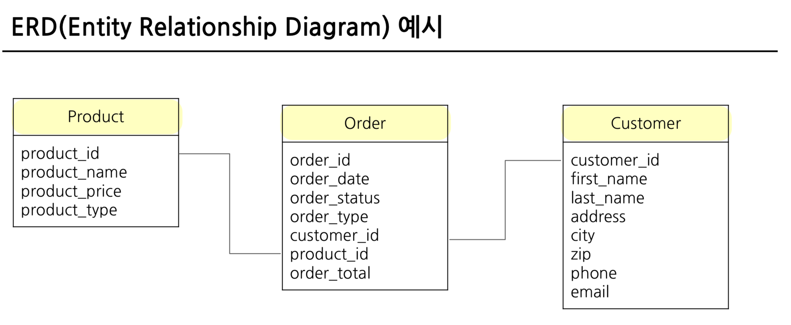
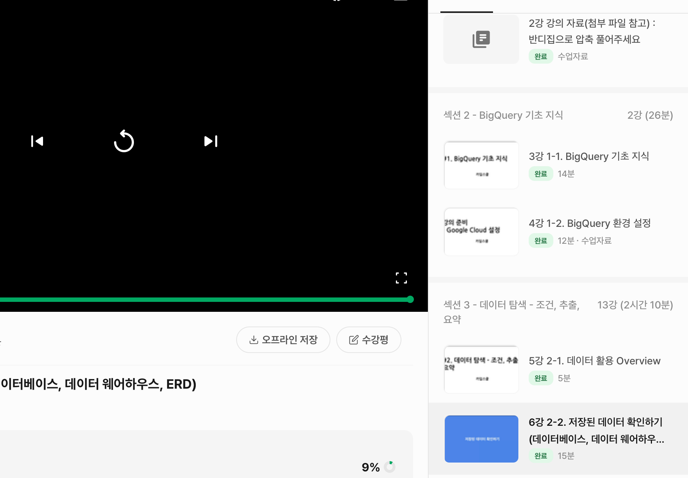

# SQL_BASIC 1주차 정규 과제 

📌SQL_BASIC 정규과제는 매주 정해진 분량의 `초보자를 위한 BigQuery(SQL) 입문` 강의를 듣고 간단한 문제를 풀면서 학습하는 것입니다. 이번주는 아래의 **SQL_Basic_1st_TIL**에 나열된 분량을 수강하고 `학습 목표`에 맞게 공부하시면 됩니다.

**👀(수행 인증샷은 필수입니다.)** 

## SQL_BASIC_1st_TIL

### 섹션 2. BigQuery 기초 지식

### 1-1. BigQuery 기초 지식

### 1-2. BigQuery 환경 설정

## 섹션 3. 데이터 탐색 - 조건, 추출, 요약

### 2-1. 데이터 활용 Overview 

### 2-2. 저장된 데이터 확인하기

## 🏁 강의 수강 (Study Schedule)

| 주차  | 공부 범위              | 완료 여부 |
| ----- | ---------------------- | --------- |
| 1주차 | 섹션 **1-1** ~ **2-2** | ✅         |
| 2주차 | 섹션 **2-3** ~ **2-5** | 🍽️         |
| 3주차 | 섹션 **2-6** ~ **3-3** | 🍽️         |
| 4주차 | 섹션 **3-4** ~ **4-4** | 🍽️         |
| 5주차 | 섹션 **4-4** ~ **4-9** | 🍽️         |
| 6주차 | 섹션 **5-1** ~ **5-7** | 🍽️         |
| 7주차 | 섹션 **6-1** ~ **6-6** | 🍽️         |

 

<!-- 여기까진 그대로 둬 주세요-->

---

# 1️⃣ 개념정리 
<!-- 강의 수강 이후에 아래의 학습 목표에 맞게 개념을 자유롭게 정리해주세요.-->
## 1-1. BigQuery 기본지식

~~~
✅ 학습 목표 :
* 데이터 관련 기초 지식(OLTP, SQL, Row, Column, 저장 형태 등)을 설명할 수 있다. 
* BigQuery 관련 기초 지식에 대해서 파악할 수 있다. 
~~~

**데이터 저장 형태**
- DB: 데이터베이스 저장소
- Table: 데이터가 저장되는 공간
  *ex) 음식 배달 서비스의 데이터 - 유저, 음식점, 음식, 라이더*

**OLTP**
- 거래를 하기 위해 사용되는 데이터베이스
- 보류, 중간 상태 X 
  -> 주문 완료 or 안하거나 => **데이터가 무결하다**
- 거래를 위한 것이라서 분석 시, 쿼리 속도는 느릴 수 있음

**SQL**
- DB에서 데이터를 가져올 때 사용하는 언어
- 쿼리문, 쿼리구문, 쿼리를 짠다 등

**테이블 구조**
- 행(Row): 가로로 한 줄 -> 하나의 고유한 데이터
  -> user_id | 음식점 | 음식 | ...
*Raw데이터는 원본데이터*
- 열(Column): 세로로 한 줄 -> 각 데이터의 특정 속성 값

**OLAP**
- OLTP의 속도, 기능 부족 -> OLAP은 분석 기능 제공

**데이터 웨어하우스(DW)**
- 데이터를 한 곳에 모아서 저장
  -> Database, 웹, 파일, API의 결과 등

**Big Query**: 구글 클라우드의 OLAP + DW
✔️ 장점
- SQL을 활용하여 쉽게 데이터 추출 O
- 빠른 속도
- DW 사용을 위해 서버 띄울 필요 X
  -> 구글에서 관리함

✔️ 비용
- 쿼리비용
  -> On-demand 요금제
  -> Capacity 요금제
- 저장비용
  -> Active Logical 저장소
  -> Long-term Logical 저장소

✔️ 환경 구성요소
- 프로젝트
  -> 하나의 프로젝트에 여러 데이터셋 존재 O
- 데이터셋
  -> 프젝 안에 있는 창고
  -> 판매데이터, 고객데이터 등 별도의 데이터 저장 O
  -> 하나의 데이터셋에 다양한 테이블 존재 O
- 테이블
  -> 창고 안의 선반 
  -> 테이블 안에 세부정보(= 행, 열로 이루어진 데이터) 존재

## 2-1. 데이터 활용 Overview

~~~
✅ 학습 목표 :
* 데이터를 활용하는 과정을 설명할 수 있다.
* 데이터를 탐색하는 과정으로 조건과 추출, 요약을 할 수 있다. 
~~~

어떤 일을 해야함(task) -> 문제 정의: 원하는 것? -> 데이터 탐색: 단일자료 / 다량의 자료
*다량의 자료를 볼 때: 연결 과정 필요*
데이터 탐색 할 때
- 조건 (필터링)
- 추출 (ex: 2024-03-09에서 2024만 추출)
- 변환 (ex: 1 -> 1명)
- 요약 (집계) 
-> 데이터 결과 검증 (예상 = 실제? - 쿼리를 짜고 나서 처음 예상과 다르게 짜고, 나중에 알게 되는 것을 방지)
-> 피드백 / 활용

**SQL 활용 부분: 데이터 탐색 ~ 데이터 결과 검증**

문제정의: MECE / so what과 why so / 지표정리 과정 등이 중요

## 2-2. 저장된 데이터 활용하기

~~~
✅ 학습 목표 :
* 데이터가 저장되는 형태를 알고 저장된 데이터를 활용할 수 있다. 
~~~

**Q. 물품창고에서 배송할 때**
- 하나씩 다 찾아보기
  -> 창고가 커지면, 어디에 물품이 있는지 확인해보는 게 좋음 
- 창고 = 데이터 웨어하우스 / 물건 = 데이터 / 옮기는 사람 = 나
  -> 데이터가 어떻게 저장되어있는지 확인하는 과정이 필요!

**ERD**
- 데이터베이스 구조, 형태를 알아볼 수 있음
*ERD가 없다면?: 어떤 테이블/컬럼이 존재하는지, 다른 테이블과 연결할 때 **어떤 컬럼**을 사용하는지, 컬럼의 값들은 **어떤 의미**를 가지는지(ex: order_status는 주문의 상태 외 배송 중, 배송 완료 등) -> 스프레드시트, 문서로 정리*

**회사에 존재하는 데이터 예시**
- 서비스에 사용: 유저 / 배송 / 물건 (웬만하면 사용)
- 앱 / 웹 로그데이타: 유저의 회원가입 ~ 컨텐츠 확인 등의 과정 확인 O 
- 공공데이터, 서드파티 데이터: 날씨, 페이스북 광고 데이터 

**포켓몬 세상을 데이터로**
- 포켓몬 세상: 포켓몬, 트레이너, 트레이너가 잡은 포켓몬, 도전한 유저배틀, 도전한 체육관 배틍, NPC, 상점, 상점 별 판매제품 등

  **-> 이커머스 산업의 데이터로**
- 포켓몬 = 상품
- 트레이너 = 유저
- 트레이너가 잡은 포켓몬 = 주문
...

**포켓몬 데이터 확인해보기**
- 나이: 최소, 최대는?
- 홈타운: 한국만 있는지, 외국도 있는지
- 포켓몬 타입: 뭐가 가장 많은지 
- 전설의 포켓몬 유무
...
*각 테이블의 id로 조인할 수 있음*

---
# 2️⃣ 학습 인증란

 
 

---

# 3️⃣ 확인문제

## 문제 1

> **🧚Q. 포켓몬 게임이나 이커머스 산업과 같이 다양한 산업에서는 각기 다른 데이터가 존재합니다. 다음 중 하나의 산업을 선택하고, 해당 산업에서 수집하고 활용될 수 있는 데이터 항목 (칼럼) 5가지를 자유롭게 상상하여 나열해보세요.**
>
> - 예시 산업 
>
> >  온라인 음식 배달 / 스마트 헬스 케어 / 중고 거래 앱 / 교육 플랫폼 등 

<!--현실과 데이터 분석의 연결 고리를 상상하고, 데이터를 저장하는 형태를 활용하는 문제입니다. -->

<!--학습한 개념을 활용하여 자유롭게 설명해 보세요. 구체적인 예시를 들어 설명하면 더욱 좋습니다.-->

~~~

✅ 산업: 스마트 헬스케어
- user_id: 각 사용자를 고유하게 식별하기 위한 값
- 나이: 연령대별 적정 운동량을 계산하기 위한 정보
- 현재 체중과 키: BMI(체질량 지수)를 계산하여 비만도를 파악하기 위한 기초 데이터
- 주 운동 횟수: 일주일 동안 얼마나 꾸준히 운동하는지 체크하는 지표
- 운동 강도: '고강도/중강도/저강도' 등 유저가 느끼는 운동의 어려움 정도

~~~

## 문제 2

> **🧚Q. 이번 강의를 통해 SQL이 왜 필요하다고 느끼는지, SQL을 통해 본인이 어떤 것을 해내고 싶은지를 자유롭게 작성해보세요.**

~~~
강의를 통해 데이터가 단순히 저장되어 있는 것보다, '어떻게 추출하고 해석하는가'가 비즈니스 의사결정에 크게 중요하다는 것을 깨달았습니다.
현업에서 다루는 데이터는 엑셀로 처리하기 힘든 방대한 양(Big Data)인 경우가 많습니다. SQL은 이러한 대규모 데이터 웨어하우스(DW)에서 내가 원하는 조건의 데이터만을 빠르고 정확하게 뽑아낼 수 있는 수단으로서 갖춰야하는 역량이라고 생각합니다!

~~~

### 🎉 수고하셨습니다.

