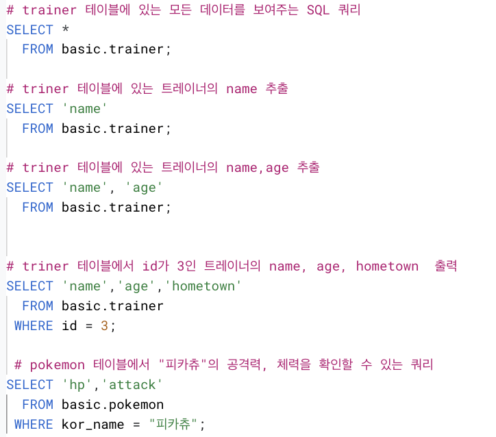
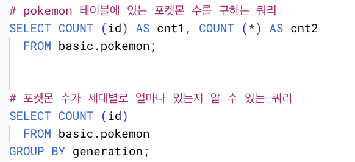
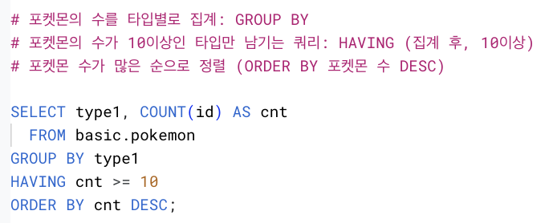
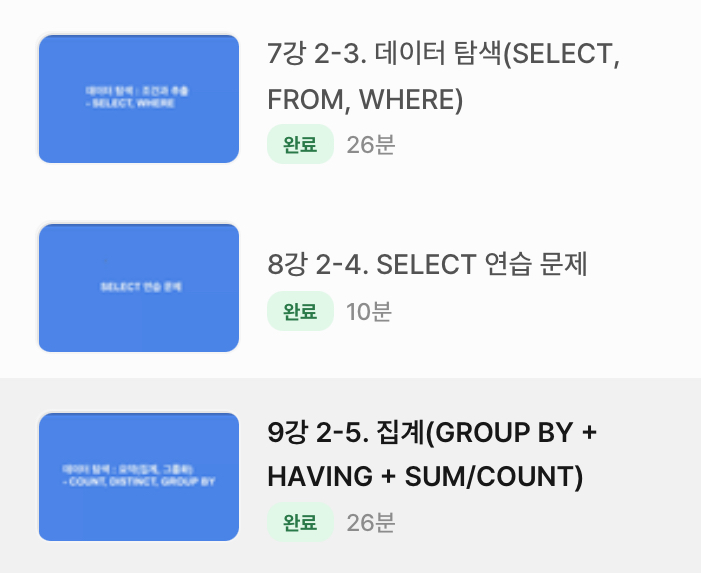

# SQL_BASIC 2주차 정규 과제 

📌SQL_BASIC 정규과제는 매주 정해진 분량의 `초보자를 위한 BigQuery(SQL) 입문` 강의를 듣고 간단한 문제를 풀면서 학습하는 것입니다. 이번주는 아래의 **SQL_Basic_2nd_TIL**에 나열된 분량을 수강하고 `학습 목표`에 맞게 공부하시면 됩니다.

**2주차 과제**는 1주차 과제처럼 SQL의 필요성이나 느낀점 위주가 아닌, **실제 강의 내용을 바탕으로 개념을 정리하고 학습한 내용을 집중적으로 기록**해주세요. 완성된 과제는 Github에 업로드하고, 링크를 스프레드시트 'SQL' 시트에 입력해 제출해주세요. 

**👀(수행 인증샷은 필수입니다.)** 

## SQL_BASIC_2nd

### 섹션 3. 데이터 탐색 - 조건, 추출, 요약

### 2-3. 데이터 탐색 (SELECT, FROM, WHERE)

### 2-4. SELECT 연습문제

### 2-5. 집계 (Group By + Having + Sum/Count)

## 🏁 강의 수강 (Study Schedule)

| 주차  | 공부 범위              | 완료 여부 |
| ----- | ---------------------- | --------- |
| 1주차 | 섹션 **1-1** ~ **2-2** | ✅         |
| 2주차 | 섹션 **2-3** ~ **2-5** | ✅         |
| 3주차 | 섹션 **2-6** ~ **3-3** | 🍽️         |
| 4주차 | 섹션 **3-4** ~ **4-4** | 🍽️         |
| 5주차 | 섹션 **4-4** ~ **4-9** | 🍽️         |
| 6주차 | 섹션 **5-1** ~ **5-7** | 🍽️         |
| 7주차 | 섹션 **6-1** ~ **6-6** | 🍽️         |

 

<!-- 여기까진 그대로 둬 주세요-->

---

# 1️⃣ 개념정리 

## 2-3. 데이터 탐색 (SELECT, FROM, WHERE)

~~~
✅ 학습 목표 :
* SQL 쿼리 구조를 이해할 수 있다. 
* SELECT, FROM, WHERE의 핵심 문법을 설명할 수 있다. 
~~~

### 포켓몬스터로 보면?
- 포켓몬 정보: 이름? 공격력? 타입?

  ex) 꼬부기 / 48(특수:50) / 물 
    
  -> 정보를 기반으로 포켓몬을 선택할 수 있음

| 이름 | 타입 | 공격력 | 특수 공격력 | 
|:---|:---:|:---:|:---:|
| 피카츄 | 전기 | 55 | 50 |
| 꼬부기 | 물 | 48 | 50 |

  ➡️ Column
⬇️ 
Row

### SQL 쿼리구조

 > **SELECT** Col1, Col2, Col3
 >
 > **FROM** Dataset.Table
 >
 > **WHERE** Col1 = 1

#### 1. FROM *어떤 테이블에서 데이터를 확인할 것인가?*
: 앞선 예시로 치면, _FROM POKEMON_

#### 2. WHERE *만약 원하는 조건이 있다면 어떤 조건인가?*
: 앞선 예시로 들면, _FROM name = '꼬부기'_

#### 3. SELECT *테이블의 어떤 컬럼을 선택(출력)할 것인가?*
: 'COL1 **AS** new_name'

  -> COL1의 이름을 new_name 으로 변경

**예시**

- **SELECT** *    *③ 모든 컬럼을 가져온다*
> SELECT *
>
> row 가 많으면, 비용이 많이 나감
>  -> 행이 적으면 큰 문제 없음

> SELECT * EXCEPT (제외할 컬럼)
> 
> 제외할 컬럼 빼고, 모두 출력
>  -> 컬럼의 수가 많을 때
>  -> Join 할 때 유용
- **FROM** basic. pokemon    *① basic(데이터셋) pokemon(테이블) 에서*
- **WHERE** type1 = "Fire"    *② type1이 Fire인 것의*

### 데이터가 여러 장소에 저장되어 있는 경우
- IF) Table A, Table B...
   : Table A, B에서 각각 추출 -> 겹치는 걸로 Join

### Pokemon 데이터로 해보기

### 핵심 정리

#### ① FROM 
- 데이터를 확인할 Table 명시 -> Dataset.table
- AS 활용: *FROM* Table1 *AS* t1(별칭)

#### ② WHERE
- FROM에 명시된 Table에 저장된 데이터 필터링 **조건설정**
- Table에 있는 컬럼을 조건 설정

#### ③ SELECT
- Table에 저장되어있는 컬럼 선택
- 여러 컬럼 선택 O
- AS 활용: *SELECT* Col1 *AS* '별칭'

### 연습문제

## 2-5. 집계 (Group By / HAVING / SUM,COUNT)
 
~~~
✅ 학습 목표 :
* 데이터를 집계하고 그룹화하는 방법을 설명할 수 있다.
* GROUP BY, HAVING, ORDER BY, 집계함수(SUM/COUNT 등)을 활용하는 방법을 설명할 수 있다.
* having과 where의 차이에 대해서 설명할 수 있다.
~~~

### 데이터 활용 과정
- 조건(필터링) 
- 추출
- 변환
- 요약: GROUP BY, 집계과정

### 집계, 그룹화
- 집계: 모아서(=그룹화) **계산**하다

  -> 계산: 더하기, 빼기 / 최대 최소값 / 평균 / 갯수 세기

### GROUP BY: *같은 값끼리 모아서 그룹화한다*
- 특정 컬럼을 기준으로 모으면서 다른 컬럼에선 집계 가능

  -> 합, 평균, MAX, MIN...

#### 예시
- 색상을 기준으로 모은다면? -> red / blue / green => GROUP BY
  
| 도형 ID | 색상 | 
|:---|:---:|
| 1 | RED | 
| 2 | RED | 
| 3 | BLUE | 
| 4 | BLUE | 
| 5 | GREEN | 
| 6 | PINK | 

**=> GROUP BY 색상**

| 색상 | 
|:---:|
| RED | 
| BLUE | 
| GREEN | 
| PINK | 

- 타입을 기준으로 그룹화해서 "평균 공격력/수" 집계하기

| 타입 | 평균공격력 | 포켓몬 수 |
|:---|:---:|:---|
| 전기 | 61 | 15 |
| 물 | 69 | 46 |
| 풀 | 65 | 21 |
| 불 | 81 | 20 |

- 여기에 "평균 공격력"이 높은 순으로 정렬한다면?

| 타입 | 평균공격력 | 포켓몬 수 |
|:---|:---:|:---|
| 불 | 81 | 20 |
| 물 | 69 | 46 |
| 풀 | 65 | 21 |
| 전기 | 61 | 15 |

**=> ORDER BY**

- 타입 당 포켓몬 수가 10마리 이상인 데이터만 추출한다면?

  -> 타입 당 포켓몬 수 집계 **후** -> HAVING

  -> 집계 **전** -> WHERE

### SQL로 표현한다면

**SELET** 집계할컬럼1. 집계함수(COUNT, MAX, MIN)

  **FROM** Table

**GROUP BY** 집계할컬럼1 (<- 기준점이 되는 컬럼)

-> 집계할 컬럼을 **SELECT**에 명시 -> 그 컬럼을 **GROUP BY**에 작성

### DISTINCT *여러 값 중, Unique한 것만 보고 싶은 경우*
- 1,2,3,3,4 -> DISTINCT -> 1,2,3,4
  
  => 즉, 중복 제거

- 메인페이지 view 수? *COUNT(user_id)*
- 메인페이지 view한 유저의 수? *COUNT(**DISTINCT** user_id)*

  -> view는 높은데, 유저가 낮으면? = 유저 1인당 view 가 높은 것임

  -> 이때 DISTINCT 사용하면, 확인할 수 있음

#### 연습

### 그룹화(집계) 활용
- 일자별 집계 (특정 시간에 유저가 한 행동이 일자별로 집계)
- 연령대별 집계 (특정 연령대에서 더 많이 구매?)
- 특정 제품 타입별 집계 (음식/전자기기/... 판매 집계)
- 앱 화면별 집계 (어떤 화면에 많이 접근?)

### 조건을 설정하고 싶은 경우
- WHERE
- HAVING

**1. WHERE**
- Table에 바로 조건 설정

**2. HAVING**
- GROUP BY로 묶은 후 -> 조건 설정

> SELECT 컬럼 1, 컬럼 2, COUNT(컬럼 1) AS col_count

 FROM table

 GROUP BY 컬럼 1, 컬럼 2
 
 **HAVING** col_count > 3

### 서브쿼리
- SELECT 문 안에 존재하는 SELECT 쿼리
- FROM 절 <- 또 다른 SELECT문 넣기 O

*서브쿼리 작성 -> 서브쿼리 바깥에서 WHERE 조건 설정*
*= 서브쿼리에서 HAVING 설정*

### ORDER BY <컬럼> <순서>
- 쿼리의 맨 아래에 위치
- 순서
  > DESC: 내림차순
  > OSC: 오름차순 (Default)

### LIMIT *쿼리문의 결과 ROW수를 제한*
- LIMIT 100; 

  -> row 수가 100개만 추출됨

#### 연습문제

## 개념 정리
- 집계: GROUP BY + 집계함수 (AVG, MAX...)
- 고유값: DISTINCT
- 조건 설정: WHERE, HAVING
- 정렬: ORDER BY
- 출력개수 제한: LIMIT

# 2️⃣ 학습 인증란

  

---

# 3️⃣ 확인문제

## 문제 1

> **🧚Q. 포켓몬 마스터 진아는 포켓몬 데이터 조회하는 SQL문에 재미를 느껴서 혼자서 데이터를 조회하는 쿼리문을 짰습니다. 하지만 세 가지의 오류로 다음 코드가 실행이 안된다고 하는데, 각 오류의 위치와 이유를 설명하고, 올바른 쿼리문으로 수정해보세요.**

~~~sql
# 진아의 SQL Query문 
SELECT name. type
FROM pokemon;
WHERE type = Electric;
~~~

~~~
① SELECT name, type 
  => 2개 이상의 컬럼을 추출할 경우, ',' 으로 구분
② FROM pokemon 
  => ; <- 쿼리의 끝에 작성해야함
③ WHERE type = 'Electric'; 
  => Electric 은 문자열 데이터/값이기에 ''로 감싸야함
~~~

## 문제 2

> **🧚Q. 앞서 SQL Query의 오류를 해결한 진아는 기분 좋게 이번에는 포켓몬 데이터에서 타입별 평균 공격력이 60 이상인 타입만 조회하려는 쿼리를 작성하려고 했습니다. 하지만 이번에도 실수를 하여 쿼리문이 실행되지 않거나 잘못된 결과가 나오고 있는데, 쿼리에서 잘못된 부분이 무엇인지 설명하고, 올바르게 수정한 쿼리를 작성해보세요.**

~~~sql
SELECT type, AVG(attack) AS avg_attack
FROM pokemon
WHERE AVG(attack) >= 60
GROUP BY type;
~~~

~~~
SELECT type, AVG(attack) AS avg_attack
FROM pokemon
GROUP BY type
HAVING avg_attack >= 60;

✔️ 잘못된 부분: 본 쿼리는 포켓몬을 타입별로 그룹화한 뒤, 그 중 평균 공격력이 60 이상인 타입만을 추출하려는 목적을 가지고 있음. 하지만 WHERE 절은 테이블에서 모든 데이터에 즉시 조건을 적용하기에, 그룹화 이후에 계산되는 '평균값'을 조회하는데 적절하지 않음. 따라서 집계 함수를 조건으로 사용할 때는 데이터를 먼저 '타입'으로 그룹화한 후, HAVING 절을 이용해야 적절한 결과를 얻음.
~~~

### 🎉 수고하셨습니다.