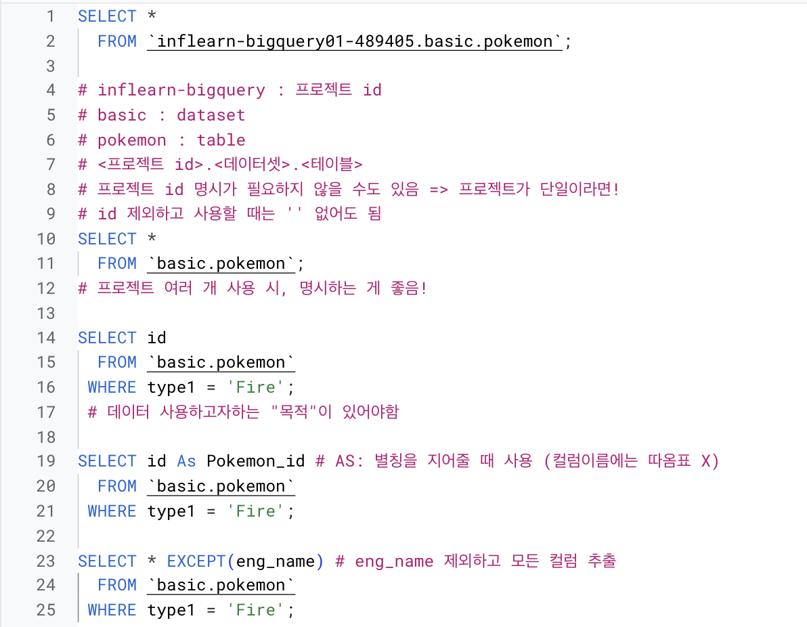

# SQL_BASIC 2주차 정규 과제 

📌SQL_BASIC 정규과제는 매주 정해진 분량의 `초보자를 위한 BigQuery(SQL) 입문` 강의를 듣고 간단한 문제를 풀면서 학습하는 것입니다. 이번주는 아래의 **SQL_Basic_2nd_TIL**에 나열된 분량을 수강하고 `학습 목표`에 맞게 공부하시면 됩니다.

**2주차 과제**는 1주차 과제처럼 SQL의 필요성이나 느낀점 위주가 아닌, **실제 강의 내용을 바탕으로 개념을 정리하고 학습한 내용을 집중적으로 기록**해주세요. 완성된 과제는 Github에 업로드하고, 링크를 스프레드시트 'SQL' 시트에 입력해 제출해주세요. 

**👀(수행 인증샷은 필수입니다.)** 

## SQL_BASIC_2nd

### 섹션 3. 데이터 탐색 - 조건, 추출, 요약

### 2-3. 데이터 탐색 (SELECT, FROM, WHERE)

### 2-4. SELECT 연습문제

### 2-5. 집계 (Group By + Having + Sum/Count)

## 🏁 강의 수강 (Study Schedule)

| 주차  | 공부 범위              | 완료 여부 |
| ----- | ---------------------- | --------- |
| 1주차 | 섹션 **1-1** ~ **2-2** | ✅         |
| 2주차 | 섹션 **2-3** ~ **2-5** | ✅         |
| 3주차 | 섹션 **2-6** ~ **3-3** | 🍽️         |
| 4주차 | 섹션 **3-4** ~ **4-4** | 🍽️         |
| 5주차 | 섹션 **4-4** ~ **4-9** | 🍽️         |
| 6주차 | 섹션 **5-1** ~ **5-7** | 🍽️         |
| 7주차 | 섹션 **6-1** ~ **6-6** | 🍽️         |

 

<!-- 여기까진 그대로 둬 주세요-->

---

# 1️⃣ 개념정리 

## 2-3. 데이터 탐색 (SELECT, FROM, WHERE)

~~~
✅ 학습 목표 :
* SQL 쿼리 구조를 이해할 수 있다. 
* SELECT, FROM, WHERE의 핵심 문법을 설명할 수 있다. 
~~~

### 포켓몬스터로 보면?
- 포켓몬 정보: 이름? 공격력? 타입?

  ex) 꼬부기 / 48(특수:50) / 물 
    
  -> 정보를 기반으로 포켓몬을 선택할 수 있음

| 이름 | 타입 | 공격력 | 특수 공격력 | 
|:---|:---:|:---:|:---:|
| 피카츄 | 전기 | 55 | 50 |
| 꼬부기 | 물 | 48 | 50 |

  ➡️ Column
⬇️ 
Row

### SQL 쿼리구조

작성예시
 SELECT COL1 AS new_name, COL2, COL3

   FROM Dataset.Table

  WHERE Col1 = 1

#### 1. FROM 
*어떤 테이블에서 데이터를 확인할 것인가?*

: 앞선 예시로 치면, _FROM POKEMON_

#### 2. WHERE
*만약 원하는 조건이 있다면 어떤 조건인가?*

: 앞선 예시로 들면, _FROM name = '꼬부기'_

#### 3. SELECT
*테이블의 어떤 컬럼을 선택(출력)할 것인가?*

: 'COL1 **AS** new_name'

  -> COL1의 이름을 new_name 으로 변경

**예시**

SELECT * *③ 모든 컬럼을 가져온다*

  FROM basic. pokemon *① basic(데이터셋) pokemon(테이블) 에서*

 WHERE type1 = "Fire" *② type1이 Fire인 것의*

> **'SELECT*'**
> - row 가 많으면, 비용이 많이 나감
>   -> 행이 적으면 큰 문제 없음

> **'SELECT * EXCEPT(제외할 컬럼)'**
> - 제외할 컬럼 빼고, 모두 출력
>   -> 컬럼의 수가 많을 때
>   -> Join 할 때 유용

### 데이터가 여러 장소에 저장되어 있는 경우
IF) Table A, Table B...

   -> Table A, B에서 각각 추출 -> 겹치는 걸로 Join

### 핵심 정리

#### ① FROM 
- 데이터를 확인할 Table 명시 -> Dataset.table
- AS 활용: *FROM* Table1 *AS* t1(별칭)

#### ② WHERE
- FROM에 명시된 Table에 저장된 데이터 필터링 **조건설정**
- Table에 있는 컬럼을 조건 설정

#### ③ SELECT
- Table에 저장되어있는 컬럼 선택
- 여러 컬럼 선택 O
- AS 활용: *SELECT* Col1 *AS* '별칭'

## 2-5. 집계 (Group By / HAVING / SUM,COUNT)
 
~~~
✅ 학습 목표 :
* 데이터를 집계하고 그룹화하는 방법을 설명할 수 있다.
* GROUP BY, HAVING, ORDER BY, 집계함수(SUM/COUNT 등)을 활용하는 방법을 설명할 수 있다.
* having과 where의 차이에 대해서 설명할 수 있다.
~~~

<!-- 새롭게 배운 내용을 자유롭게 정리해주세요.-->

# 2️⃣ 학습 인증란

<!-- 이 글을 지우고, 여기에 학습한 것을 인증해주세요.-->

  

---

# 3️⃣ 확인문제

## 문제 1

> **🧚Q. 포켓몬 마스터 진아는 포켓몬 데이터 조회하는 SQL문에 재미를 느껴서 혼자서 데이터를 조회하는 쿼리문을 짰습니다. 하지만 세 가지의 오류로 다음 코드가 실행이 안된다고 하는데, 각 오류의 위치와 이유를 설명하고, 올바른 쿼리문으로 수정해보세요.**

~~~sql
# 진아의 SQL Query문 
SELECT name. type
FROM pokemon;
WHERE type = Electric;
~~~

~~~
여기에 답을 작성해주세요!
~~~

## 문제 2

> **🧚Q. 앞서 SQL Query의 오류를 해결한 진아는 기분 좋게 이번에는 포켓몬 데이터에서 타입별 평균 공격력이 60 이상인 타입만 조회하려는 쿼리를 작성하려고 했습니다. 하지만 이번에도 실수를 하여 쿼리문이 실행되지 않거나 잘못된 결과가 나오고 있는데, 쿼리에서 잘못된 부분이 무엇인지 설명하고, 올바르게 수정한 쿼리를 작성해보세요.**

~~~sql
SELECT type, AVG(attack) AS avg_attack
FROM pokemon
WHERE AVG(attack) >= 60
GROUP BY type;
~~~

~~~
여기에 답을 작성해주세요.
~~~

### 🎉 수고하셨습니다.