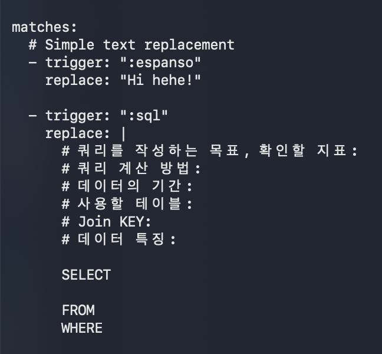
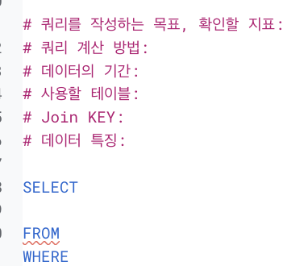
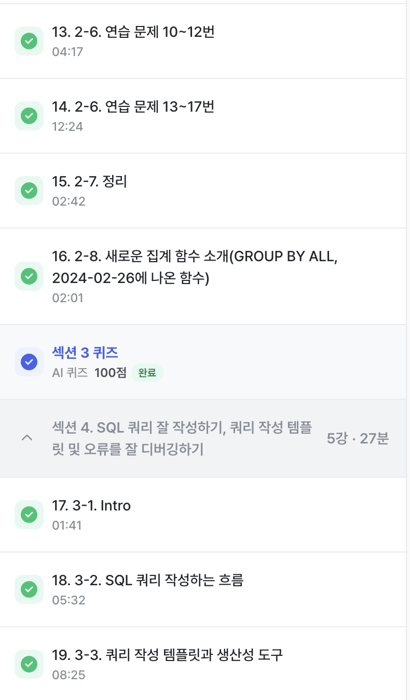

# SQL_BASIC 3주차 정규 과제 

📌SQL_BASIC 정규과제는 매주 정해진 분량의 `초보자를 위한 BigQuery(SQL) 입문` 강의를 듣고 간단한 문제를 풀면서 학습하는 것입니다. 이번주는 아래의 **SQL_Basic_3rd_TIL**에 나열된 분량을 수강하고 `학습 목표`에 맞게 공부하시면 됩니다.

**3주차 과제는 문제 풀이를 중심으로**, 강의에서 제시된 예제 문제 중 **7 문제 이상을 선택하여 직접 풀어본 뒤**, 강의 영상의 풀이와 비교해 **틀린 부분, 맞은 부분, 새롭게 배운 개념**을 구체적으로 정리해주세요. (적어도 3문제는 정리해야 합니다.) 완성된 과제는 Gihub에 업로드하고, 링크를 스프레드시트 'SQL' 시트에 입력해 제출해주세요.

**👀(수행 인증샷은 필수입니다.)** 

## SQL_BASIC_3rd

### 섹션 3. 데이터 탐색 - 조건, 추출, 요약

### 2-6. 연습문제 1~3번

### 2-6. 연습문제 7~9번

### 2-6. 연습문제 10~12번

### 2-6. 연습문제 13~17번

### 2-7. 정리 

### 2-8. 새로운 집계함수

## 섹션 4. 쿼리 잘 작성하기, 쿼리 작성 템플릿 및 오류를 잘 디버깅하기

### 3-1. INTRO

### 3-2. SQL 쿼리 작성하는 흐름

### 3-3. 쿼리 작성 템플릿과 생산성 도구 

## 🏁 강의 수강 (Study Schedule)

| 주차  | 공부 범위              | 완료 여부 |
| ----- | ---------------------- | --------- |
| 1주차 | 섹션 **1-1** ~ **2-2** | ✅         |
| 2주차 | 섹션 **2-3** ~ **2-5** | ✅         |
| 3주차 | 섹션 **2-6** ~ **3-3** | ✅         |
| 4주차 | 섹션 **3-4** ~ **4-4** | 🍽️         |
| 5주차 | 섹션 **4-4** ~ **4-9** | 🍽️         |
| 6주차 | 섹션 **5-1** ~ **5-7** | 🍽️         |
| 7주차 | 섹션 **6-1** ~ **6-6** | 🍽️         |

 

<!-- 여기까진 그대로 둬 주세요-->

---

# 1️⃣ 개념정리

## 2-6. 연습문제

~~~
✅ 학습 목표 :
* 연습문제(7문제 이상) 푼 것들 정리하기
~~~

### 연습문제 1: 포켓몬 중 type2가 없는 포켓몬 수를 작성하는 쿼리

- null: 0과 다름 -> 값이 존재하지 않음을 의미함
- is null

> select count(id)
>
> from basic.pokemon
>
> where type2 is null;

-- where에 여러 조건 입력 => AND, OR
-- where type2 is null AND type 1 = "Fire"
-- whrer (type2 is null) OR (type 1 = "Fire")

### 2. type 2가 없는 포켓몬의 type1과 type1의 포켓몬 수를 알려주는 쿼리 작성. 단, type1의 포켓몬 수가 큰 순으로 정렬

> select type1, count(id) AS pokemon_cnt
>
> - 집계함수는 GROUP BY 와 함께 다님
> - 집계하는 기준(컬럼)이 없으면 COUNT 만 써도 됨
> - 근데 기준 컬럼이 있으면 GROUP BY 에 기준컬럼 써야함  
>
> from basic.pokemon
> 
> where type2 IS NULL
> 
> group by type1
>
> order by pokemon_cnt DESC; #내림차순

### 3. type2 상관없이 type1의 포켓몬 수를 알 수 있는 쿼리

- type2 상관없이? => 조건 아님!

> select type1, count(id) AS pokemon_cnt
>
> from basic.pokemon
>
> group by type1;

### 4. 전설 여부에 따른 포켓몬 수를 알 수 있는 쿼리

- 전설여부: 조건 X, GROUP BY

> select count(id) AS pokemon_cnt
> 
> from basic. pokemon
> 
> group by is_legendary;

- group by: 컬럼이 여러개 올 수 있음
- group by 1 => select의 첫 컬럼을 의미
- order by 애도 1, 2 등 사용할 수 있음 => 결과를 빠르게 볼 때 유용

### 5. 동명이인이 있는 이름은 무엇일까요?

- 동명이인 = 같은 이름이 2개이상
- count(name) = 2 이상

> select name, count(name) AS trainer_cnt
> 
> from basic. trainer
> 
> group by name;

- 방법 1. HAVING
> select name, count(name) AS trainer_cnt
> 
> from basic. trainer
>
> group by name
>
> having trainer_cnt = 2;
> - 집계 후 조건 => HAVING

- 방법 2. 서브쿼리
> select *
>
> from ( 
> 
> select name, count(name) AS trainer_cnt
> 
> from basic. trainer
> 
> group by name )
>
> where trainer_cnt >= 2;

### 7. Iris, Whitney, Cynthina 트레이너 정보 쿼리

> select *
> 
> from basic.trainer
> 
> where name = 'Iris' AND name = 'Whitney'; 
>
> - "AND" 는 두 조건 모두 충족하는 것을 출력함 => 아무것도 안나옴

> select *
> 
> from basic.trainer
>
> where (name = 'Iris') OR (name = 'Whitney') OR (name = 'Cynthina');
>  
> - AND, OR 이 꼬일 수 있기에 () 쓰기

- IN 사용
> select *
>
> from basic.trainer
>
> where name IN ('Iris', 'Whitney', 'Cynthina'); -- IN 사용

### 9. 세대 별로 포켓몬 수가 얼마나 되는가?

> select generation, count(id)
>
> from `basic.pokemon`
>
> group by generation;

### 10. type 2가 존재하는 포켓몬 수는?

- IS NOT NULL

> select count(id)
>
> from basic.pokemon
>
> where type2 IS NOT NULL;

### 11. type2가 있는 포켓몬 중에 제일 많은 type1은?

> select type1, count(id) AS pokemon_cnt
>
> from basic.pokemon
>
> where type2 IS NOT NULL
>
> group by type1
>
> order by pokemon_cnt DESC 
>
> - 여기에서 제일 많은 type1만 궁금한 것이기에 행을 제한 => LIMIT
>
> LIMIT 1;

### 12. 단일(하나의 타입만 있는) 타입 포켓몬 중 많은 type1은?

> select type1, count(id) AS pokemon_cnt
>
> from basic.pokemon
>
> where type2 IS NULL
>
> group by type1 
>
> order by pokemon_cnt DESC
>
> LIMIT 1;

### 13. 포켓몬 이름에 "파"가 들어가는 포켓몬

> select kor_name
>
> from basic.pokemon
>
> where kor_name **LIKE** '%파%'; 

-  컬럼 LIKE -> 문자열 컬럼에서 특정 단어가 포함되어있는지 알고 싶을 떄 좋음

### 15. 보유한 포켓몬이 가장 많은 트레이너는?

> select trainer_id, count(pokemon_id) AS pokemon_cnt
> 
> - 같은 id의 포켓몬을 여러 마리 잡을 수 있기에 DISTINST 안씀
>
> from basic.trainer_pokemon
>
> group by trainer_id
>
> order by pokemon_cnt DESC
>
> LIMIT 1;

### 16. 포켓몬을 많이 풀어준 트레이너는?

> select trainer_id, **count(pokemon_id) AS pokemon_cnt**
>
> from basic.trainer_pokemon
>
> where **status = "released"**
>
> group by **trainer_id**
>
> order by pokemon_cnt DESC
>
> LIMIT 1;

### 17. 트레이너별로 풀어준 포켓몬의 비율이 20%가 넘는 포켓몬 트레이너는?

- 풀어준 포켓몬 비율: 풀어준 포켓몬 수 / 전체 포켓몬 수 
- COUNTIF(컬럼 = "3")

> select countif(trainer_id = 17)
>
> from `basic.trainer_pokemon`;

> select count(id)
> 
> from `basic.trainer_pokemon`
>
> where trainer_id = 17;

#### 본격적으로 풀기 

> - SELECT
>
>   trainer_id,
>
>   **COUNTIF(status = "Released") AS released_cnt,** # 풀어준 포켓몬 수
>
>   **COUNT(pokemon_id) AS pokemon_cnt,** # 전체 포켓몬 수
>
>   **COUNTIF(status = "Released")/COUNT(pokemon_id) AS released_ratio**
> 
> - FROM `basic.trainer_pokemon`
>
> - GROUP BY trainer_id # 트레이너 아이디별로
>
> - **HAVING released_ratio >= 0.2; # 비율이 0.2 이상인**

## 2-8. 새로운 집계함수

~~~
✅ 학습 목표 :
* SQL 쿼리 구조를 이해할 수 있다. 
* SELECT, FROM, WHERE을 활용하는 방법을 설명할 수 있다. 
~~~

**GROUP BY *ALL***
- 그룹화할 키를 추론해서 자동으로 컬럼을 안써도 올라감

> **SELECT** first_name, last name, SUM (pointscored)
>
> FROM playerstats
>
> GROUP BY first_name, last_name

=> GROUP BY ALL

> **SELECT** first_name, last name, SUM (pointscored)
>
> FROM playerstats
>
> GROUP BY ALL

## 3-2. 쿼리를 작성하는 흐름

~~~
✅ 학습 목표 :
* 쿼리를 작성하는 흐름을 설명할 수 있다.
~~~

#### 1. 지표고민 - 어떤 문제를 해결하기 위해 데이터가 필요?
#### 2. 지표 구체화 - 구체적인 지표 명시 (분자, 분모 표시)
#### 3. 지표탐색 - 유사한 문제를 해결한 케이스가 있는가?
     
-> 존재한다면, 해당 쿼리 리뷰
-> 없다면, 구글 지피티 등 활용

#### 4. 쿼리 작성 - 데이터가 있는 테이블(ERD) 찾기

-> 1개 - 바로 활용
-> 2개이상 - JOIN

#### 5. 데이터 정합성 확인 - 예상한 결과와 동일한지 확인
#### 6. 쿼리 가독성 - 나중에 보기 좋도록 ^^...
#### 7. 쿼리 저장 - 재사용되기에 문서로 저장하기

## 3-3. 쿼리 작성 템플릿과 생산성 도구

~~~
✅ 학습 목표 :
* 생산성 도구를 만들 수 있다.
~~~

### 쿼리 작성 템플릿

> - 쿼리 작성의 목표, 확인할 지표
> - 쿼리 계산 방법 -> 집계? 나열? 
> - 데이터의 기간
> - 사용할 테이블
> - JOIN KEY
> - 데이터 특징 -> 어떤 컬럼은 어떤값을 가지고...

*글로 작성해두고, 쿼리를 작성하면 훨씬 수월해짐*

### 생산성 도구

- 템플릿 사용을 까먹기 떄문에 활용하면 좋음

**https://espanso.org/**
- 특정 단어 입력 -> 원하는 문장 (템플릿)을 변경

  => 특정 단어가 감지되면, 정의된 것으로 바꿈
  
  => **MATCH** - *trigger*: date / *replace*: OCTOBER 11, 2021
> today is: date
>
> today is OCTOBER 11, 2021

 
 

---

# 2️⃣ 학습 인증란

  

---

# 3️⃣ 확인문제

## 문제 1

> **🧚Q. Q. 포켓몬 연구에 흥미를 느낀 혜인은 각 타입(type1)별 평균 공격력(attack)을 비교해보고 싶었습니다.**
>
> 그래서 다음과 같은 필요한 정보를 미리 정리해보았습니다. 

~~~
조건 : attack이 50 이상인 포켓몬만 포함
보고 싶은 컬럼 : type1
집계 내용 : 각 type1 별 평균 공격력
정렬 기준 : 평균 공격력을 기준으로 내림차순 정렬
~~~

> **이 목표를 바탕으로 혜인은 아래와 같은 쿼리를 작성했지만, 일부 SQL 문법 요소를 빼먹었습니다. 비어 있는 부분인 ㄱ, ㄴ, ㄷ, ㄹ 에 들어갈 알맞은 SQL 구문을 채워보세요:**

~~~sql
SELECT type1, (ㄱ)
FROM pokemon
(ㄴ) attack >= 50
(ㄷ) type1
ORDER BY (ㄱ) (ㄹ);
~~~

~~~
ㄱ: AVG(attack)
ㄴ: WHERE
ㄷ: GROUP BY
ㄹ: DESC
~~~

### 🎉 수고하셨습니다. 