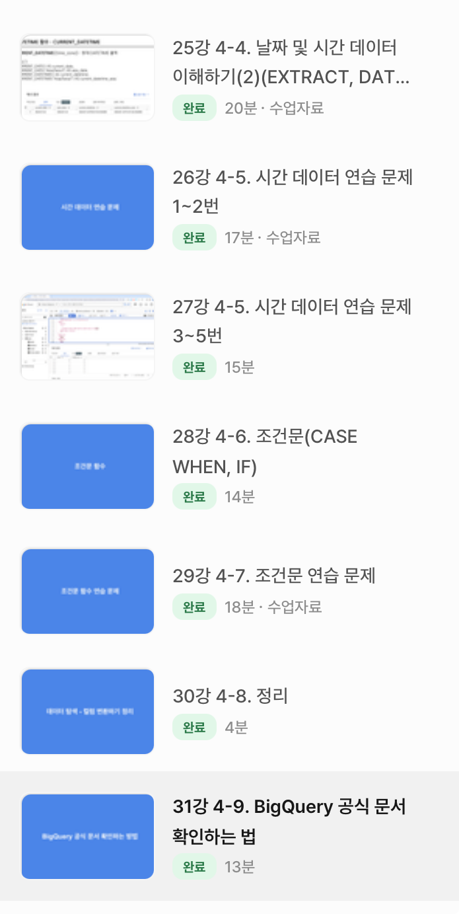

# SQL_BASIC 5주차 정규 과제 

📌SQL_BASIC 정규과제는 매주 정해진 분량의 `초보자를 위한 BigQuery(SQL) 입문` 강의를 듣고 간단한 문제를 풀면서 학습하는 것입니다. 이번주는 아래의 **SQL_Basic_5th_TIL**에 나열된 분량을 수강하고 `학습 목표`에 맞게 공부하시면 됩니다.

**5주차 과제는 문제 풀이를 중심으로**, 강의에서 제시된 예제 문제 중 **3 문제 이상을 선택하여 직접 풀어본 뒤**, 강의 영상의 풀이와 비교해 **틀린 부분, 맞은 부분, 새롭게 배운 개념**을 구체적으로 정리해주세요. (적어도 4문제는 정리해야 합니다.) 완성된 과제는 Gihub에 업로드하고, 링크를 스프레드시트 'SQL' 시트에 입력해 제출해주세요.

**👀(수행 인증샷은 필수입니다.)** 


## SQL_BASIC_5th

### 섹션 5. 데이터 탐색 - 변환

### 4-4. 날짜 및 시간 데이터 이해하기(2) (EXTRACT, DATETIME_TRUNC, PARSE_DATETIME, FROMAT_DATETIME)

### 4-5. 시간 데이터 연습문제 1~2번

### 4-5. 시간 데이터 연습문제 3~5번

### 4-6. 조건문 (CASE WHEN, IF)

### 4-7. 조건문 연습 문제

### 4-8. 정리

### 4-9. BigQuery 공식 문서 확인하는 법

(강의에서 연습문제가 많아서 따로 프로그래머스 문제 과제는 없습니다.)


## 🏁 강의 수강 (Study Schedule)

| 주차  | 공부 범위              | 완료 여부 |
| ----- | ---------------------- | --------- |
| 1주차 | 섹션 **1-1** ~ **2-2** | ✅         |
| 2주차 | 섹션 **2-3** ~ **2-5** | ✅         |
| 3주차 | 섹션 **2-6** ~ **3-3** | ✅         |
| 4주차 | 섹션 **3-4** ~ **4-4** | ✅         |
| 5주차 | 섹션 **4-4** ~ **4-9** | ✅         |
| 6주차 | 섹션 **5-1** ~ **5-7** | 🍽️         |
| 7주차 | 섹션 **6-1** ~ **6-6** | 🍽️         |

<br>


<!-- 여기까진 그대로 둬 주세요-->

---

# 4-4. 날짜 및 시간 데이터 이해하기(2) (EXTRACT, DATETIME_TRUNC, PARSE_DATETIME, FROMAT_DATETIME)

~~~
✅ 학습 목표 :
* 날짜 및 시간 데이터에 대해서 더 자세히 설명할 수 있다. 
* CURRENT_TIME, EXTRACT, DATETIME_TRUNC, PARSE_DATETIME, FROMAT_DATETIME 을 설명할 수 있다. 
~~~

### ✔︎ CURRENT_DATETIME([time_zone])
- 현재 DATETIME 출력

```
CURRENT_DATETIME() AS current_datetime,
CURRENT_DATETIME("Asia/Seoul") AS current_datetime_asia;
```

### ✔︎ EXTRACT
- DATETIME 에서 특정 부분만 추출하고 싶을 때
```
EXTRACT(DATE FROM DATETIME "2024-01-02 14:00:00") AS date,
EXTRACT(YEAR FROM DATETIME "2024-01-02 14:00:00") AS year,
EXTRACT(MONTH FROM DATETIME "2024-01-02 14:00:00" AS DATETIME) AS month,
EXTRACT(DAY FROM DATETIME "2024-01-02 14:00:00" AS DATETIME) AS day,
EXTRACT(HOUR FROM DATETIME "2024-01-02 14:00:00" AS DATETIME) AS hour,
EXTRACT(MINUTE FROM DATETIME "2024-01-02 14:00:00" AS DATETIME) AS minute,
```
* 요일 추출 : EXTRACT (DAYOFWEEK FROM datetime_col)
    - DAYOFWEEK: 한 주의 첫날이 일요일, [1,7] 범위의 값을 반환
     
      -> sun: 1, mon: 2, tues: 3...

### ✔︎ DATETIME_TRUNC
* DATETIME_TRUNC(datetime_col, HOUR) 
    - DATE, HOUR만 남기기 => *시간 자르기*
    - "2024-01-02 14:42:13"을 HOUR로 자름
   
      -> "2024-01-02 14:00:00"

``` 
DATETIME "2024-03-02 14:42:13" AS original_data,
DATETIME_TRUNC(DATETIME "2024-03-02 14:42:13", DAY) AS day_trunc,
DATETIME_TRUNC(DATETIME "2024-03-02 14:42:13", YEAR) AS year_trunc,
DATETIME_TRUNC(DATETIME "2024-03-02 14:42:13", MONTH) AS month_trunc,
DATETIME_TRUNC(DATETIME "2024-03-02 14:42:13", HOUR) AS hour_trunc;
```

### ✔︎ PARSE_DATETIME
* PARSE_DATETIME('문자열의 형태', 'DATETIME 문자열') AS datetime
   - 문자열인 DATETIME -> DATETIME 타입으로 변환
   - PARSE_DATETIME('%Y-%m-%d%H:%M:%S','2024-01-11 12:35:35')ASparse_datetime;

### ✔︎ FORMAT_DATETIME
- DATETIME 타입 데이터 -> 문자열 데이터로 변환
- FORMAT_DATETIME("%c", DATETIME "2024-01-11 12:35:35") AS formatted;

| PARSE | FORMAT |
| ----- | -----|
| 문자열 -> DATETIME | DATETIME -> 문자열 |

### ✔︎ LAST_DAY
* LAST_DAY(DATETIME)
    - 마지막날을 알고 싶은 경우
    - 자동으로 월의 마지막 값을 계산해서 특정 연산을 할 경우

```
LAST_DAY(DATETIME '2024-01-03 15:30:00')          # 2024-01-03 추출
LAST_DAY(DATETIME '2024-01-03 15:30:00', MONTH)  # 2024-01-31 추출, 1월의 마지막 날
LAST_DAY(DATETIME '2024-01-03 15:30:00', WEEK)   # 2024-01-06, 0103 주의 마지막 날
LAST_DAY(DATETIME '2024-01-03 15:30:00', WEEK(SUNDAY))  # 2021-01-07
```

### ✔︎ DATETIME_DIFF
- DATETIME_DIFF(첫 DATETIME, 두번째 DATETIME, 궁금한 차이)
- 두 DATETIME의 차이를 알고 싶은 경우

## ✶ 정리 ✶

### 🗓️ 날짜 및 시간데이터 타입

* DATE
* DATETIME : DATE + TIME. 타임존 정보 X
* TIMESTAMP : 특정 시점에 도장찍은 값. 타임존 정보 O
* UTC : 국제적인 표준 시간. 한국은 UTC+9
* Millisecond : 1/1000초
* Microsecond : 1/1000ms


### 🕐 시간 데이터 타입 변환
* 시간 데이터 타입 변환하기
* TIMESTAMP_MILLIS
* TIMESTAMP_MICROS
* DATETIME
    - 문자열 => DATETIME : PARSE_DATETIME
    - DATETIME => 문자열 : FORMAT_DATETIME

* 현재 DATETIME : CURRENT_DATETIME
* 특정 부분 추출 : EXTRACT
* 특정 부분 자르기 : DATETIME_TRUNC
* DATETIME 차이 구하기 : DATETIME_DIFF


# 4-6. 조건문(CASE WHEN, IF)

~~~
✅ 학습 목표 :
* 조건문 함수의 기능을 이해하고, 설명할 수 있다. 
~~~

## 조건문 함수란?

- 특정 조건 충족하면, 행동하도록 
- 특정 조건 참 = A, 아니면 B
* 특정 카테고리를 하나로 합치는 전처리가 필요할 수 있음
    - 분석할 때 조건 설정해서 변경 👍
    - 저장할 때부터 합치면, 쪼개서 보기 ❌ 
* 조건문 사용 방법
    1) CASE WHEN
    2) IF

### CASE WHEN
- 여러 조건이 있을 때 유용
```
SELECT
CASE 
WHEN 조건1 THEN 조건1이 참일 경우 결과
WHEN 조건2 THEN 조건2가 참일 경우 결과
ELSE 그 외 조건일 경우 결과
END AS 새로운_컬럼_이름

- 조건 1, 조건 2 모두에 해당하면 -> 앞선 순서를 따름 
```

#### 예시 1: "Rock&Ground”라는 타입 새로 만들기

```
SELECT
 *,
 CASE 
 WHEN (type1 IN ("Rock", "Ground")) OR (type2 IN ("Rock", "Ground")) 
 THEN "Rock&Ground"
 ELSE type1
 END AS new_type1

 - type1 또는 type2에 돌, 땅이 있으면 -> "Rock&Ground" 추출
 - 그 외의 것 -> "기존의 type1" 추출 
```

#### 예시 2: 각 포켓몬의 공격력(attack)을 기준으로, 50 이상이면 'Strong', 100 이상이면 'Very Strong', 그 이하면 'Weak'으로 분류

- 큰 조건부터 작성
- *100 이상 -> 50 이상 -> 그 이하*

```
WHEN attack >= 100 THEN 'Very Strong'   # 100 이상
WHEN attack >= 50 THEN 'Strong'         # 50 이상 (100 미만)
ELSE 'Weak'                             # 그 외 
END AS attack_level
``` 

### IF
- 단일 조건인 경우 
- IF(조건문, TRUE일 때 값, FALSE일 때 값) AS 새로운_컬럼_이름

* 예시
1) IF(1=1, '동일한 결과', '동일하지 않은 결과') AS result1

    -> result 1: 동일한 결과
2) IF(1=2, '동일한 결과', '동일하지 않은 결과') AS result2

    -> result 2: 동일하지 않은 결과

 # 4-5. 시간 데이터 연습문제 & 4-7. 조건문 연습 문제

~~~
✅ 학습 목표 :
* 4-5, 4-7 각각에서 두 문제 이상 (최소 4문제) 푼 내용 정리하기
~~~

### 1. 트레이너가 포켓몬을 포획한 날짜(catch_date)를 기준으로, 2023년 1월에 포획한 포켓몬의 수를 계산해주세요
```
SELECT 
  COUNT (DISTINCT id) AS cnt
FROM basic.trainer_pokemon
WHERE
  EXTRACT(YEAR FROM DATETIME(catch_datetime, "Asia/Seoul")) = 2023  # catch_datetime은 timestamp로 저장 -> DATETIME 으로 변경
  AND EXTRACT(MONTH FROM DATETIME (catch_datetime, "Asia/Seoul")) = 1
```

### 4. 배틀이 일어난 날짜(battle_date)를 기준으로, 요일별로 배틀이 얼마나 자주 일어났는지 계산해주세요
```
SELECT
  day_of_week,
  COUNT(DISTINCT id) AS battle_cnt
FROM (
   SELECT
     *,
     EXTRACT(DAYOFWEEK FROM battle_date) AS day_of_week
     FROM basic.battle
)
GROUP BY
day_of_week
ORDER BY
day_of_week
```

###  포켓몬의 'speed'가 70 이상이면 '빠름', 그렇지 않으면 '느림'으로 표시하는 새로운 컬럼 'Speed_Category'를 만들어 주세요
- 단일 조건 => IF문 사용
```
SELECT
 id,
 kor_name,
 speed,
 IF(spped >= 70, "빠름", "느림") AS Speed_Category
FROM basic.pokemon
```

### 3. 각 포켓몬의 총점(total)을 기준으로, 300 이하면 'Low', 301에서 500 사이면 'Medium', 501 이상이면 'High'로 분류해주세요
- 여러 조건 => case when 사용
```
SELECT
  *
FROM (
SELECT
 id,
 kor_name,
 total,
 CASE 
   WHEN total >= 501 THEN "High"
   WHEN total BETWEEN 300 AND 500 THEN "Medium"
ELSE "Low"
END AS total_grade
FROM basic.pokemon
)
WHERE
  total_grade = "Low"
```
<br>

<br>

---

# 확인문제

## 문제 1

> **🧚Q. 광윤이는 카페 주문 로그 데이터(order_log)를 분석하여, '오전(0시-11시)'과 '오후(12시-23시)'의 주문 건수를 집계하려고 합니다. 광윤이가 작성한 다음 SQL 쿼리 중 문법적으로 틀렸거나 의도한 결과가 나오지 않는 것을 모두 골라보세요. (복수 선택 가능)**

~~~sql
1. SELECT 
   IF(EXTRACT(HOUR FROM order_time) < 12, '오전', '오후') AS time_type,
   COUNT(*)
   FROM order_log
   GROUP BY time_type;

2. SELECT 
   DATETIME_TRUNC(order_time, HOUR) AS truncated_hour,
   COUNT(*)
   FROM order_log
   WHERE order_time BETWEEN '2021-01-01' AND '2021-12-31'
   GROUP BY order_time;

3. SELECT 
   FORMAT_DATETIME(order_time, '%H') AS order_hour,
   COUNT(*)
   FROM order_log
   GROUP BY 1;

4. SELECT 
    CASE 
      WHEN EXTRACT(HOUR FROM order_time) BETWEEN 0 AND 11 THEN '오전'
      ELSE '오후'
    AS time_group,
    COUNT(*)
   FROM order_log
   GROUP BY time_group;
~~~

<!-- 틀린쿼리에 대한 오류의 원인도 같이 작성해주세요. 문제에서 제공된 order_time 컬럼은 DATETIME type의 데이터를 가지고 있다고 가정합니다. -->

~~~
틀린 쿼리: 2, 3, 4

- 2: GROUP BY를 order_time으로 하고 있어 시간 단위로 묶이지 않음 + 문제에서 요구한 오전/오후 집계가 아님
- 3번: FORMAT_DATETIME 함수의 인자 순서가 잘못됨
       -> FORMAT_DATETIME('%H', order_time) 
       -> 이 쿼리는 오전/오후가 아닌, 시간별 집계임
- 4: CASE 문에 END가 빠져서 문법 오류 발생

- 1: IF(EXTRACT(HOUR FROM order_time) < 12, '오전', '오후')  # 오전/오후 구분
     GROUP BY time_type으로 집계 
~~~


## 문제 2

> **🧚Q. 예운이는 포켓몬 타입에 따라 설명을 부여하는 쿼리를 작성했습니다. type 1 컬럼의 값에 따라 조건을 분기했으며, 다음 SQL 쿼리를 실행했습니다.**

~~~sql
SELECT name,
       CASE 
         WHEN type1 = 'Fire' THEN 'Hot'
         WHEN type1 = 'Water' THEN 'Cool'
         ELSE 'Normal'
       END AS type_description
FROM pokemon;
~~~

> **다음 중 type_description의 결과가 'Normal'로 출력될 포켓몬은?**

| **name**   | **type1** |
| ---------- | --------- |
| Pikachu    | Electric  |
| Charmander | Fire      |
| Squirtle   | Water     |
| Bulbasaur  | Grass     |

<!-- 근거와 함께 답을 작성해주세요 -->

~~~
답: Pikachu, Bulbasaur

 type1이 'Fire'이면 'Hot', 
'Water'이면 'Cool'로 출력하고,
그 외 값은 모두 ELSE 조건에 의해 'Normal'로 출력됨

Pikachu는 Electric, Bulbasaur은 Grass → Normal
~~~



<br>

### 🎉 수고하셨습니다.